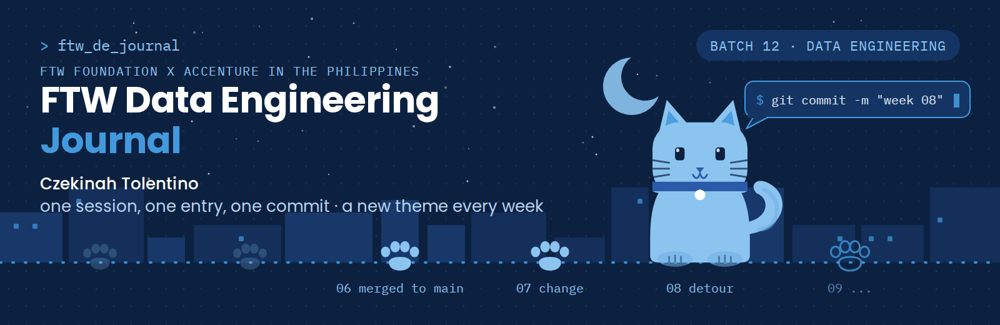

# FTW Data Engineering Journal

   

One session, one entry, one commit.

This is where I write down what actually happened on FTW Saturdays, in the voice I use at 1 a.m. The LinkedIn version is the polished one. This is the one with the receipts.

## Route so far

| Stop | Date | Theme | Entry |
|---|---|---|---|
| 06 | 2026-08-29 | merged to main | [The Week Everything Became Traceable](journal/2026-08-29-day6.md) |
| 07 | 2026-09-05 | change | [Same Saturday, Different Everything](journal/2026-09-05-day7.md) |
| 08 | 2026-09-12 | detour | [Heavy Detour, Same Road](journal/2026-09-12-day8.md) |
| 09 | 2026-09-19 | ... | NYC Mobility. Coming up. |

Weeks 1 to 5 happened before this journal existed. They live on [LinkedIn](https://www.linkedin.com/in/czekinah/recent-activity/all/).

<details>
<summary><b>You: why does every week look different</b></summary>

<br>

Because every week felt different. Each Saturday gets its own theme and colours on LinkedIn, and the same theme runs the banner at the top of that week's entry here. Week 6 was a commit graph. Week 7 was a butterfly on a journey line. Week 8 is a green taxi on an NYC street. I do not know what Week 9 is yet. That is the point.

</details>

## How an entry works

<details>
<summary><b>The sections, and why they are there</b></summary>

<br>

- **Today in one sentence**: if you read nothing else, read this
- **What I learned**: numbered stops, each with a check badge (see below)
- **Terms I am still learning**: the words I could not use in a sentence yet
- **What confused me**: written down on purpose, so future me can see it got resolved
- **One small next step**: checkboxes. I come back and tick them
- **Git checkpoint**: proof that the entry was a Git rep, not just a note
- **Evidence from today**: photos, repos, links
- **Reflection** and **Mood or meme**: the honest part

</details>

<details>
<summary><b>The "You:" toggles</b></summary>

<br>

The questions inside the collapsible blocks are the ones I imagine a reader asking. Open them for the longer answer, skip them for the short version. The entry makes sense either way.

</details>

## Check badges

Every stop gets a badge, borrowed from the data quality checks we write in class.

| Badge | Meaning |
|---|---|
|  | Understood it. Could explain it to a groupmate |
|  | Got through it. Still chewing on it |
|  | Did not land. Reopened in a later entry |
|  | Something that had not happened before |

## Where else I keep receipts

- LinkedIn, the weekly carousel version: [linkedin.com/in/czekinah](https://www.linkedin.com/in/czekinah/)
- Week 9 group project: [nyc-mobility-pipeline](https://github.com/cricraps/nyc-mobility-pipeline)
- Week 6 group project: [Week6-Instacart-Pipeline](https://github.com/jg0901/Week6-Instacart-Pipeline)
- Portfolio: [czekinah.github.io](https://czekinah.github.io)

## Folder guide

```
journal/    one file per session, YYYY-MM-DD-dayN.md
assets/     photos, banners, and the carousel covers
templates/  the starting files, untouched, in case you want to start your own
```

## Credits

Built from [ogbinar/ftw-de-journal](https://github.com/ogbinar/ftw-de-journal), Sir Myk's journal template for FTW scholars. Its one rule still holds: small notes, small commits, often.
