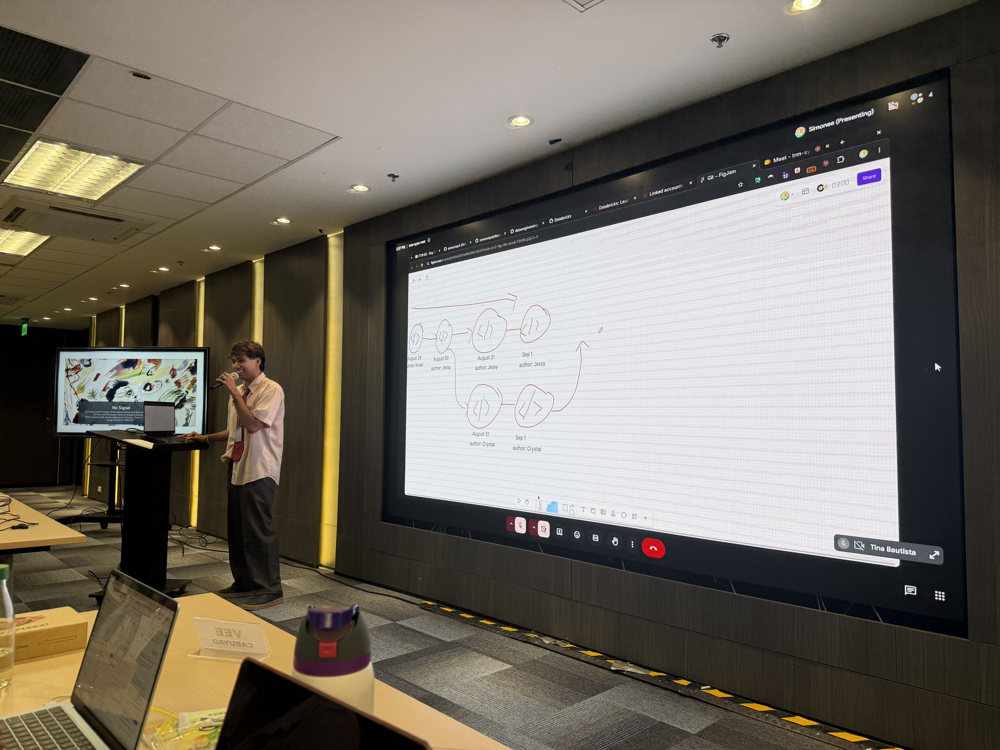
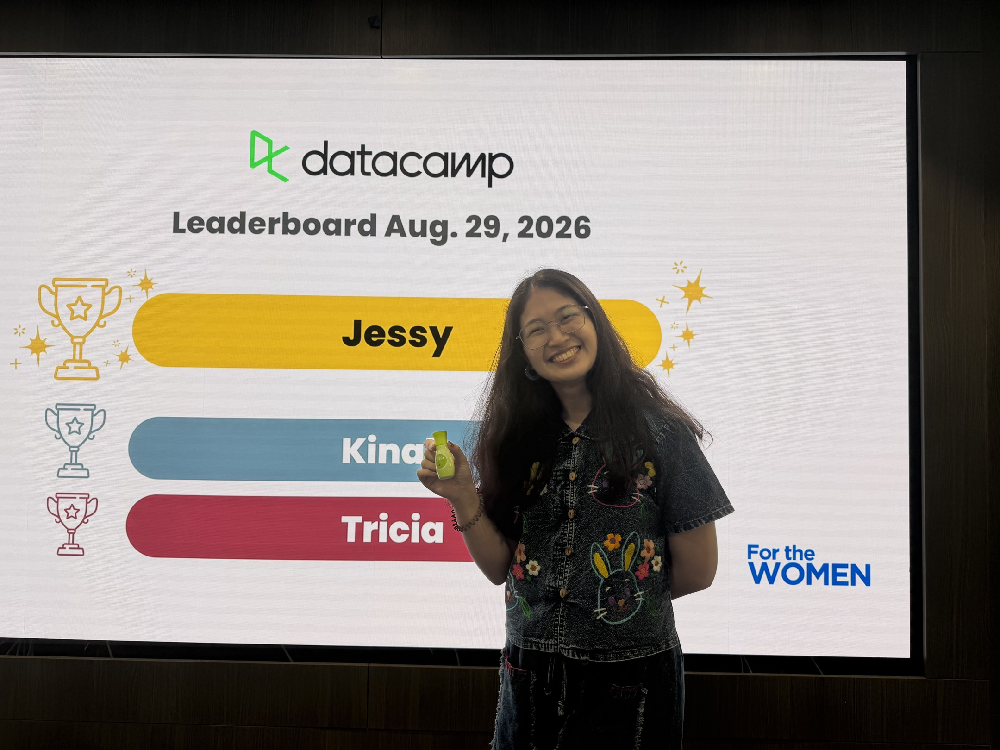
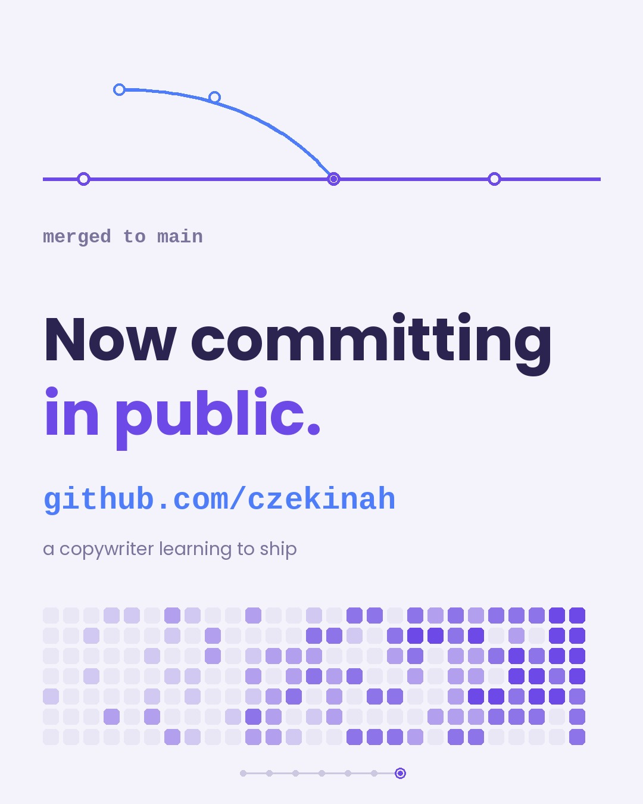

# Journal - 2026-08-29 - Day 6: The Week Everything Became Traceable

**FTW Foundation Batch 12 x Accenture, Data Engineering Track.**

## Today in one sentence
- Data modeling went from doing to understanding, and Git made our work traceable.

Every good story has a draft history nobody sees. Day 6 taught me that engineering refuses to hide it.

## What I learned

### Morning: why did we build it that way

We reviewed our Chinook dimensional models, and the question was not what did you build but why did you build it that way. Last week I could construct a star schema. This week I can defend one.

- **Grain is a contract.** One row equals one invoice line. Declare it first, and every measure on the table has to be true at that level.
- **The BY test.** Revenue by genre, sales by month, spending by customer. The words after "by" are your dimensions. The thing being measured is your fact.
- **Stored is not the same as consumed.** Normalization runs the business, dimensional models help you understand it. Two sets of rules for two different jobs.
- **Validation is not vibes.** A successful query is not enough. Validate the grain, uniqueness, and the business numbers. When something is wrong, change the structure, not the truth.

### Afternoon: a commit is a snapshot you can trace back

Sir Simonee walked us through Git and GitHub. A pipeline is not finished just because the SQL works. It has to survive change, bugs, new requirements, and new engineers. Working code needs to become managed code.

Version control answers what changed, why, and who changed it. No more pipeline_final_FINAL.sql. One file, with history.

We made our first commits from Databricks to GitHub. Change, validate, commit, push. I have been calling my drafts versions for years. Now my versions have receipts.

*August 29, author: Kinah.*

Sir Hans of Z-Lift Solutions said documentation is engineering infrastructure. Document what others cannot easily infer. Git says what changed. Docs say why, and how to run it.

### The rest of the day

Last session with Ms. Camille Escudero of Lily of the Valley: our biology as data, healthcare access as a right. We shared stories of being women in the workplace and went home with gifts and lighter shoulders.

Minutes after joking to my seatmate that my name could never make the DataCamp leaderboard, I got called for ranking second in class XPs. I am learning to stop writing myself out of rooms I already earned a seat in.

## Terms I am still learning
- **Grain**: what one row means in a table, declared before anything else is built
- **Fact vs dimension**: the fact is the measure, the dimensions are the words after "by"
- **Commit**: one saved checkpoint of change, with a message that says why

## What confused me
- Git the tool versus GitHub the host. The lecture compressed it into one line: Git tracks, GitHub shares
- When a change deserves its own branch versus a direct commit. My team's answer a few days later: every edit starts on a task based branch, and one person merges to main

## One small next step
- [x] Use a task based branch and a pull request for my Instacart pre-cleaning work instead of touching main directly

## Git checkpoint
- [x] I created or updated a file
- [x] I wrote a commit
- [x] I pushed my changes

## Evidence from today
- The photos in this entry
- Our team pipeline repo: https://github.com/jg0901/Week6-Instacart-Pipeline
- The journal template this repo is built from: https://github.com/ogbinar/ftw-de-journal

## Reflection
- Easy: the writing half of documentation
- Difficult: trusting that small, frequent commits beat one perfect upload
- Next time: merge conflicts, before one finds me

## Mood or meme
- "Trace changes" is just the engineering term for keeping receipts. As a copywriter I have never felt more seen.

*My Week 6 as a commit history. Merged to main.*
