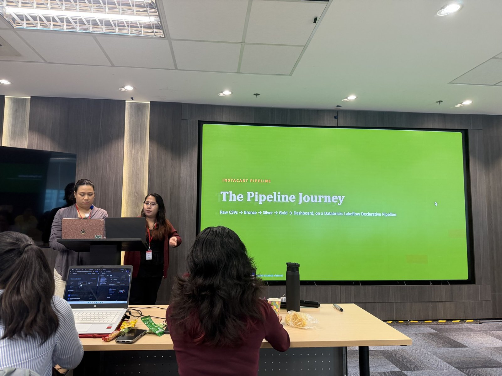
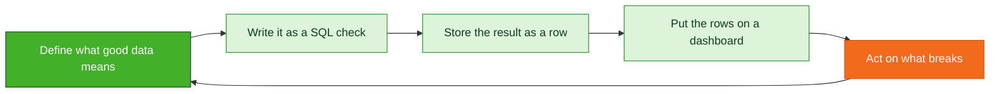
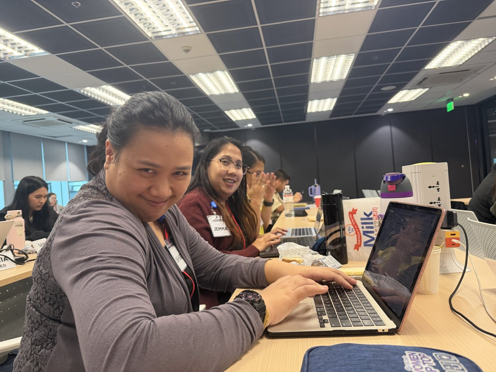
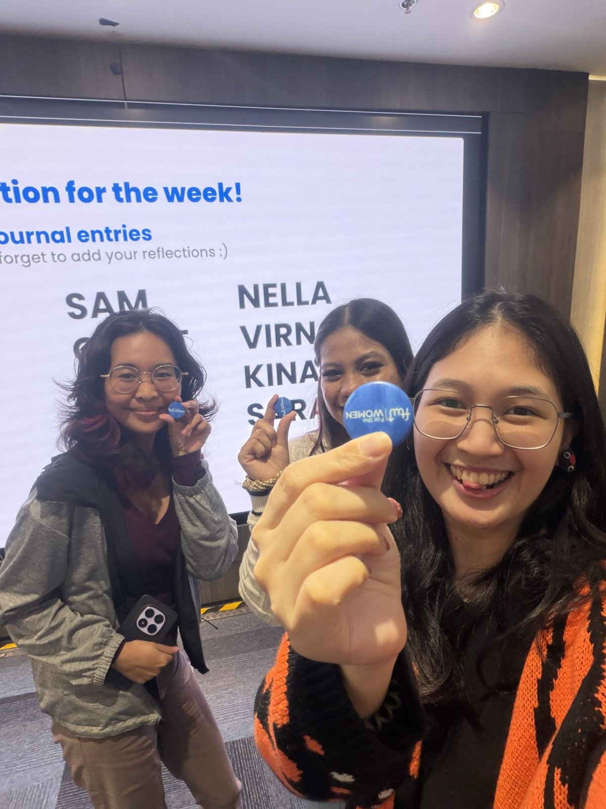
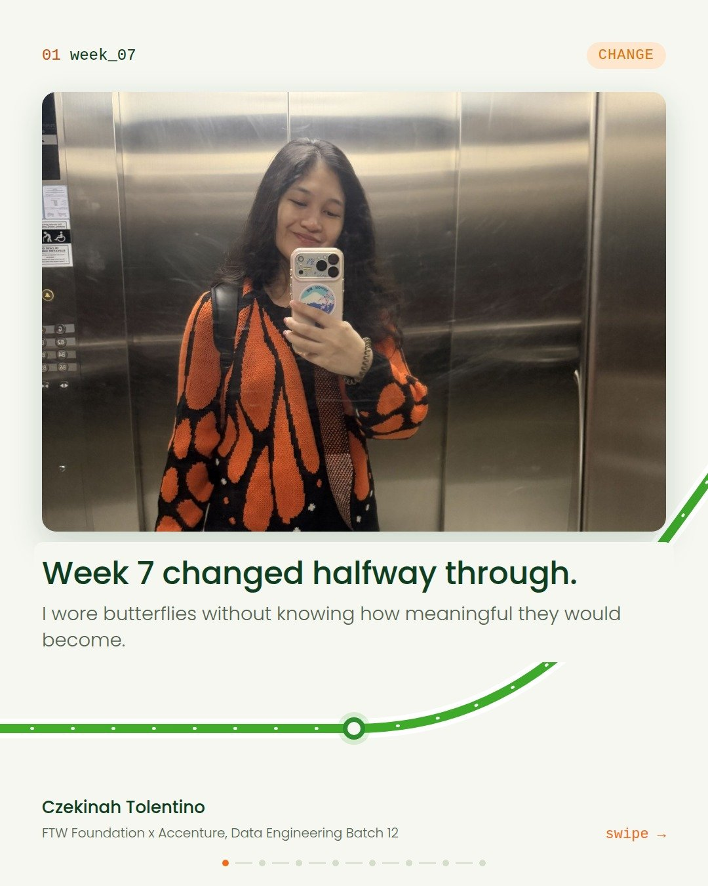

# Journal - 2026-09-05 - Day 7: Same Saturday, Different Everything

**FTW Foundation Batch 12 x Accenture, Data Engineering Track.**

  

## Today in one sentence

- I dressed like a butterfly for Week 7 and did not know change would be the theme of the day.

---

Okay, sit down. I need to tell you about Saturday.

You know how every FTW Saturday has the same shape? Table Topics, a five minute presentation, a technical lesson, homework, go home. I walked in expecting exactly that. I even grabbed the butterfly cardigan off the top of the pile without thinking.

Every familiar part came with a twist. In order:

<b>You: just give me the schedule version first</b>

 

| Block | Usual | Day 7 |
|---|---|---|
| Table Topics | PREP structure, filler word count | Body language, camera on |
| Presentation | Demo, 5 minutes | Instacart: progress, lessons, challenges |
| Lecture | One topic | Spark, then data quality |
| Lab | Write SQL | Write five data quality checks |
| Announcements | Homework | OULAD, new groupings, journal pin |

Fine. Now let me tell it properly.

---

## What I learned

### 01 Same exercise, new focus

Table Topics with Ms. Tina, but this time the camera was watching. We recorded ourselves and watched everything back. The eye contact we dropped, the gestures we held back, the habits we did not notice while speaking.

My topic: does saying no matter more than saying yes when you are building the life you want? I said yes. Yes to a scholarship in a field that was not mine, which is the only reason I was in that room.

Good answer. Delivered while holding my phone like a microphone.

<b>You: okay but what did the tape actually show</b>

 

- One hand hiding behind the phone the entire time
- Eye contact dropped twice, both times right before a point I cared about
- Open hand gestures: present, unplanned. My body knew before I did
- Homework: watch it back. Once was enough for this week.

> [!TIP]
> Gestures are not just for the audience. They help you land the point too. Seven years writing for other people's cameras and I never once thought about my own hands.

---

### 02 Five minutes to share it

Two weeks of work, five minutes to present it. Jemma and Shiena went up for our team and shared our Instacart pipeline: the progress, the lessons, the challenges behind it.

They were great. I was in the audience clapping like a proud tita.

<b>You: did every group say the same things</b>

 

Yes, which is how you know they are the real lessons. Pull from main before you touch anything. One branch per task. One person merges. Document what the next engineer cannot infer. Sir Myk's closer: five minutes is the reality forever, so make the work visible inside them.

---

### 03 Same instructor, different lesson

**Morning, Spark.** SQL is a language, Spark is an engine. Same question, different scale. Filter before you join.

> [!IMPORTANT]
> Do not default to Spark. Complexity must earn its place.

**Afternoon, data quality.** We moved from building pipelines to asking a better question: can we trust the data coming out of them? A pipeline is not finished just because it runs.

Six basic checks: null, unique, range, accepted values, referential integrity, volume. Before you run any of them you write down what you expect, the threshold, the severity, and the owner. Without a threshold a check is just an opinion with a WHERE clause.

<b>You: pop quiz me. My customer_id column has zero nulls. Clean data?</b>

 

Not necessarily. Zero nulls means nobody left it blank. It says nothing about whether the values are real, unique, or match the customers table. Null is one check out of six. This exact trap is waiting for me in OULAD, where a column encodes "not known" as a literal question mark and passes every null check with a straight face.

---

### 04 A familiar habit, recognized

I got called up for a special FTW pin for documenting the journey on GitHub. This journal. The one I write assuming the only reader is me at 1 a.m.

It is not even new behavior. I already reflect through my LinkedIn posts every week. One session, one entry, one commit just gave the habit a new home.

---

### 05 Well-fed pipeline

Merienda was Amber, courtesy of Accenture Philippines. Volume check: expected one box, observed zero rows remaining.

---

### 06 The biggest plot twist

Last announcement of the day. After three weeks with Shiena, Jemma and Via, we were reshuffled into new teams.

The room went quiet for about a minute. Three weeks is long enough to know who reads the brief twice, who tests everything, who says "wait" at exactly the right moment. Shiena, Jemma and Via are the people who made me feel like I could actually contribute to a technical team. And now, kanya-kanya na.

<b>You: be honest, what was going through your head</b>

 

1. No.
2. Okay but why.
3. Oh. Because this is literally the job.
4. Fine.
5. Actually, fine.

> [!NOTE]
> New data entering a pipeline that never stops moving. New personalities, new working styles, new best practices, and Sir Hans as our new support instructor.

Maybe that was the real lesson of Week 7. Growth does not always arrive as a completely new challenge. Sometimes it is the same room, the same routine, and the same you, being asked to show up differently.

---

## Terms I am still learning

- **Expectation**: the rule a check tests, with a threshold that says how much failure is tolerable
- **Severity**: what happens when the threshold is breached, from a dashboard note to stopping the pipeline
- **Partition**: how Spark splits data across workers, and why joining across partitions costs money
- **Observability**: watching the pipeline over time, not just checking the data once

## What confused me

- PASS, WARN, FAIL at the check level versus PASS, WARN, REJECT at the row level. I kept both and wrote the decision down so nobody reads it as a typo.
- Where Spark stops being a tool and starts being a career. Current answer: use SQL, reach for PySpark when the data argues for it.

## One small next step

- [ ] Build the studentInfo Silver layer with a `dq_check_results` table in the lecture's shape
- [ ] Learn three new names and how each person likes to receive a "wait"
- [ ] Watch the Table Topics tape a second time. Count the hand.

## Git checkpoint

- [x] I created or updated a file
- [x] I wrote a commit
- [x] I pushed my changes

## Evidence from today

- The photos in this entry, from my Week 7 batch documentation
- Our Instacart pipeline repo: https://github.com/jg0901/Week6-Instacart-Pipeline
- The OULAD dataset we start this week: https://analyse.kmi.open.ac.uk/open-dataset

## Reflection

- What felt easy: turning the data quality framework into a table design. It is a brief with columns.
- What felt difficult: hearing that Spark is mostly not needed, right after deciding I wanted to be good at it
- What I want to understand better: how thresholds get chosen when there is no history yet to say what normal looks like

## Mood or meme

- I dressed for the change by accident. I am showing up for it on purpose. Also, kanya-kanya na. I crie.

<b>You: so how does this end</b>

 

Depends who you are.

- If you are a future groupmate: hi. I read the brief twice and I say "wait" a lot. It is a feature.
- If you are Shiena, Jemma or Via: thank you. You know for what.
- If you are me at 1 a.m.: the shuffle is when Spark moves data between workers for a join. It is expensive. Filter first. Go to sleep.

The rest of my commits will live here.
