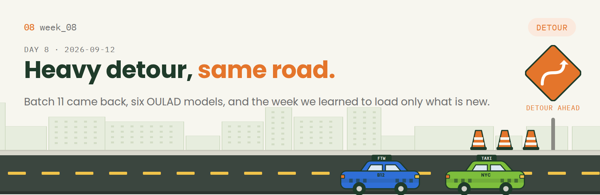
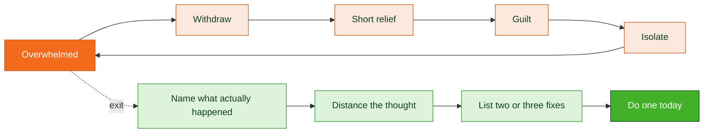
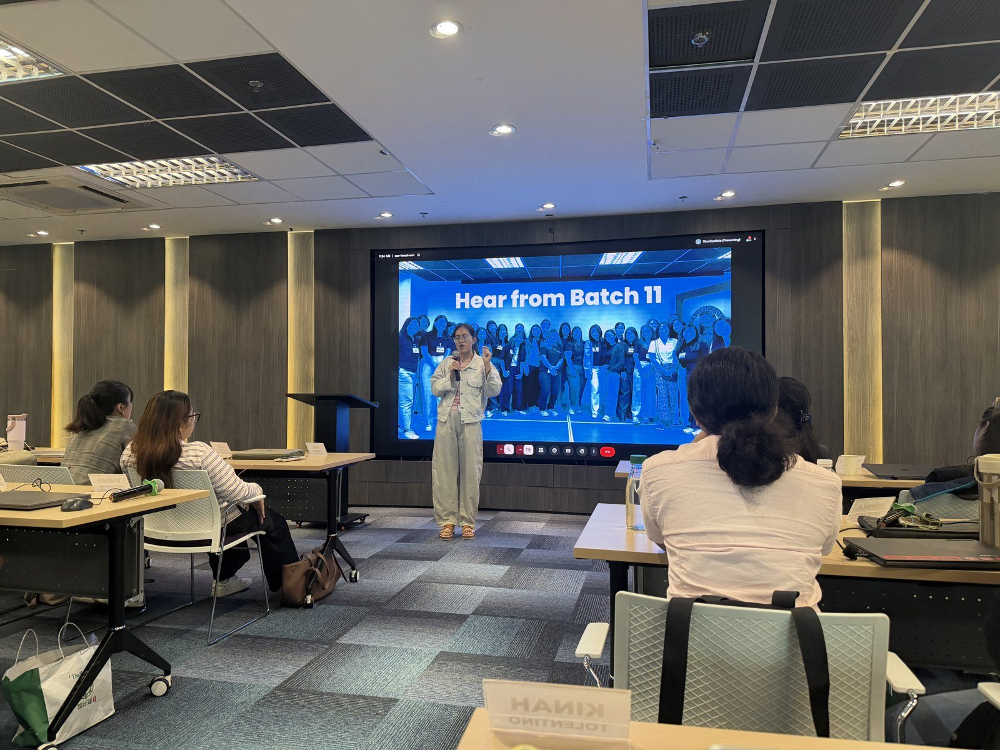
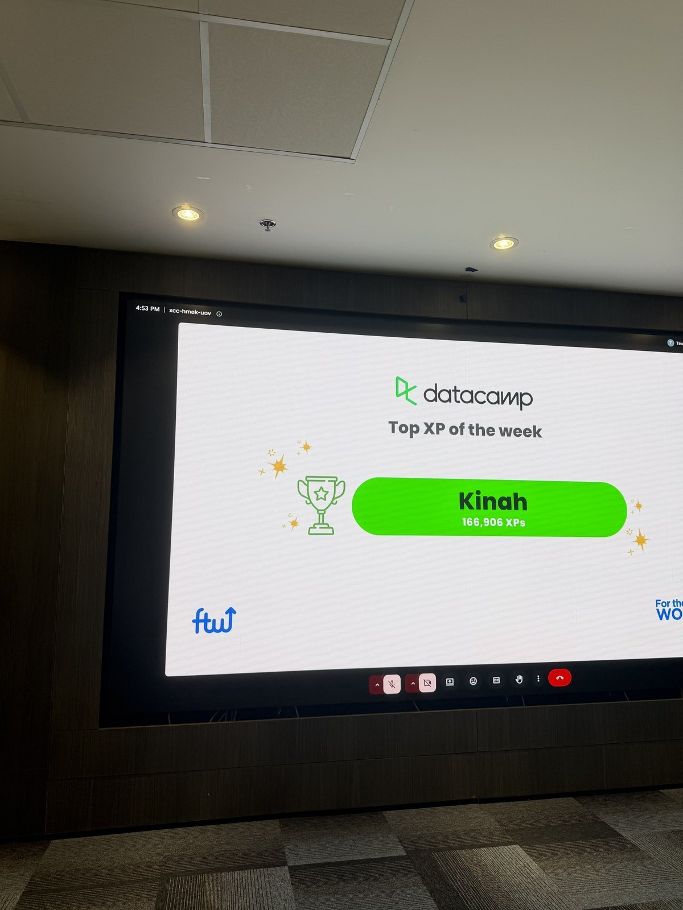
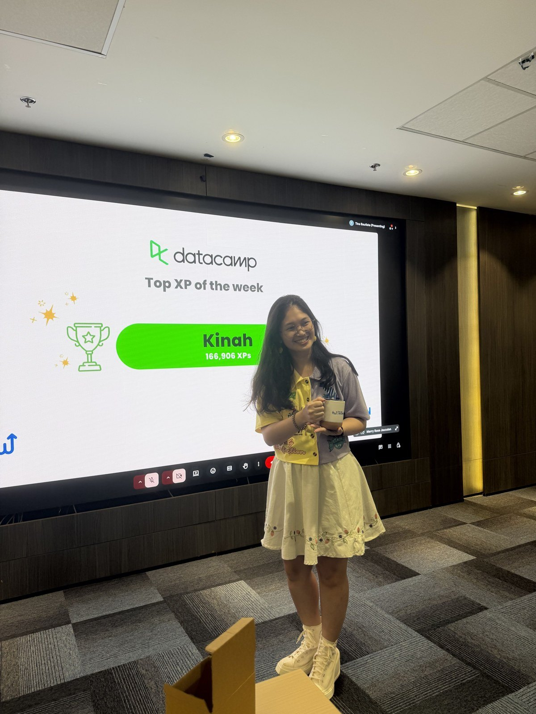
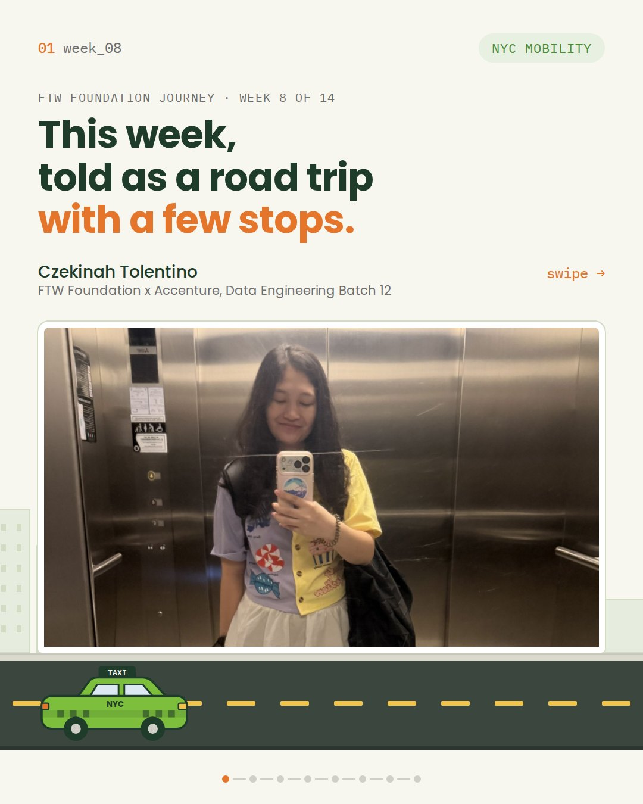
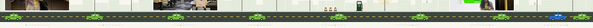

# Journal - 2026-09-12 - Day 8: Heavy Detour, Same Road

**FTW Foundation Batch 12 x Accenture, Data Engineering Track.**

  

## Today in one sentence

- Week 8 felt less like a highway and more like a heavy detour, and the lesson was that staying on the road counts.

---

Okay. This one took me a few days to write.

The technical homework this week is NYC Mobility. Taxi trips, weather, traffic advisories. The real traffic was the mental and emotional fatigue that hits at this point of a bootcamp, and a sobering moment as a cohort that reminded us how fragile this journey can be. I am not writing the details here. What I want to keep is what we did with it.

<b>You: schedule version first, please</b>

 

| Block | Usual | Day 8 |
|---|---|---|
| Opening | Table Topics | Three golden rules and the mental doom loop |
| Guests | None | Batch 11 came back, then breakout groups with them |
| Presentations | Five minutes per team | Six teams, one OULAD dataset |
| Lecture | One topic | Incremental ingestion, then four ways to collect data |
| Lab | Write SQL | Pull seven days of BGC weather from an API |
| Announcements | Homework | NYC Mobility, new groups, DataCamp top XP |

Fine. Now let me tell it properly.

---

## What I learned

### 01 Detour ahead

Ms. Tina opened with the three golden rules from orientation. Be present, be persistent, be professional. Then a diagram I have been thinking about all week: the mental doom loop.

From the outside the loop looks like someone stopped caring. From the inside it feels like relief, then guilt, then more hiding. The exit is boring on purpose. Name the event, not the story about it. Say "I am having the thought that I don't belong here" instead of "I don't belong here." Pick one fix. Do it today, not eventually.

> [!IMPORTANT]
> Learning is not a straight line. It happens in steps, and the flat part of the step is where most people quit.

<b>You: which step are you on</b>

 

The flat one. I can build a pipeline. I cannot yet explain to myself why some weeks it feels like nothing is moving. Writing this entry is the one fix I picked today.

---

### 02 Hear from Batch 11

A year ago they sat where we sit now. They did not gloss over the hard parts.

- Divine worked full time on the day shift through the whole program. Her rule: tell your groupmates early when you cannot show up, so nobody spends brain cells wondering where you are.
- The Above and Beyond awardee ran one on one Slack sessions with a groupmate who was struggling. Use whatever edge you have, then give it away.
- Royce, now a collection strategy analyst at GCash, told us her capstone team was asked to revise the entire project a week before graduation. What got them through: communication, sharing resources, and giving each other grace.
- The Game Changer awardee had a full time job, a part time app, and a thesis on top of the classes. She scored one point under passing on a quiz and had to dance in front of the class. Her list: take a break, ask early, break it into smaller parts, use AI to understand and not just copy, show up even if it is not perfect.

Then she read a letter she wrote to her future self at 2:47 AM during her Chinook assignment last year.

> "I'm still here, showing up, doing my best. I'm doing this for you."

It changed the energy in the room. It was the exact anchor we needed.

<b>You: what did you take from the breakout group</b>

 

Someone has to step up, and it does not have to be the loudest person. Notify things early. Do not assume, double check. And the line I underlined twice: separate the person from the problem.

---

### 03 Six teams, one dataset

Every team presented an OULAD pipeline. Same data, six different models: galaxy schemas with two fact tables, dbt tests, CI/CD, data quality dashboards with a trust summary on top.

Sir Myk asked every team the same question. Why this model? His closer: a better model is not a more complex one. It is simple enough to explain and complex enough to answer the business question. The simpler road or the complex one, chosen on purpose.

> [!TIP]
> Regardless of the instructions, the customer is the priority. If following the brief means you cannot answer the question, challenge the brief.

---

### 04 Fuel for the week ahead

Afternoon lecture with Sir Myk, plus a guest data engineer from Avanti on incremental loading and Sir Hans of Z-Lift Solutions on idempotency.

Data never stands still. Every dataset we touched before this week was a static file we loaded once. Real pipelines get new rows tomorrow, changed rows next week, and duplicates whenever the source hiccups. So: load only what is new.

| Move | What it does | When |
|---|---|---|
| Append | Add new rows, keep everything | History tables, logs |
| Merge (upsert) | Insert new rows, update changed ones | Most operational tables |
| Refresh | Replace the whole table | Small lookups, exchange rates |

- **SCD Type 1** overwrites the old value. **Type 2** keeps the old row and adds a new one. Choose based on whether anyone will ever ask "what was it before."
- **Idempotent** means running the pipeline twice gives the same result as running it once. Merge on a business key, deduplicate with a window function, keep a lookback window for late data.
- Complexity has a cost. Streaming is real time and expensive. Most Philippine companies run batch, so batch is the skill to have.

Then four ways to collect data, because data is always somewhere else:

<b>You: the four patterns, quickly</b>

 

1. **Files.** CSV, JSON, Parquet. A landing folder, then a loop that ingests whatever is new in it.
2. **Databases.** Connect, query, never `SELECT *` on a table you have not sized.
3. **APIs.** Endpoint, parameters, JSON response. Read the docs, respect rate limits, paginate. Some websites hide their own APIs in the Network tab.
4. **Web scraping.** `requests` to download the page, `pandas.read_html` or `BeautifulSoup` to parse it. Last resort, not first. Websites change, anti-scraping measures exist, and technically possible does not mean allowed.

Provenance on everything: source, ingested_at, batch_id, so a bad batch can be traced and thrown out.

Lab: seven days of BGC temperature from the Open-Meteo API into a table. Then blog posts from a test API into a DataFrame, a CSV, and a Delta table. Small, ugly, and it ran.

---

### 05 Top XP of the week

Two weeks ago I joked that my name could never make the DataCamp screen, then landed second. This week it was first. 166,906 XPs and a mug.

The mug stays on the desk as a reminder that showing up counts, even on the weeks it does not feel like it.

---

### 06 Homework: NYC Mobility

New groups again, new dataset. Build a repeatable ingestion pipeline that combines public NYC sources into one mobility dataset:

- Green taxi trips, published monthly as Parquet
- Taxi zones, a CSV lookup
- Weather from an API
- NYC DOT weekly traffic advisories, scraped from a web page

I took the scraping part. The page overwrites itself every week and keeps no archive, so the table we build is the only history. Everything from today applies: merge on a business key, keep history, make it safe to rerun.

---

## Terms I am still learning

- **Idempotent**: run it twice, get the same result as running it once
- **Upsert**: insert if new, update if it exists, in one MERGE
- **SCD Type 2**: keep the old row, add a new one, so history survives the change
- **Late-arriving data**: rows that show up after the day they belong to, handled with a lookback window
- **Provenance**: the metadata columns that say where a row came from and when

## What confused me

- Append versus merge versus refresh. The lecture's answer: it depends on whether anyone needs the history. Which means the real work is asking that question before writing the code.
- Where hidden APIs sit on the line between clever and not allowed. Current answer: read robots.txt and the terms, collect the minimum, and when in doubt, do not.

## One small next step

- [ ] Scrape the DOT advisory page into a raw table with a scrape_date and a business key, then rerun it to prove zero duplicate inserts
- [ ] Check in on one batchmate this week. A two minute message, no agenda
- [ ] Write my own letter to future me, dated for graduation day

## Git checkpoint

- [x] I created or updated a file
- [x] I wrote a commit
- [x] I pushed my changes

## Evidence from today

- The photos in this entry, from my Week 8 batch documentation
- My Week 8 LinkedIn post: https://www.linkedin.com/feed/update/urn:li:activity:7506271045289672705/
- Our NYC Mobility repo: https://github.com/cricraps/nyc-mobility-pipeline
- Open-Meteo API docs: https://open-meteo.com/en/docs
- NYC TLC trip record data: https://www.nyc.gov/site/tlc/about/tlc-trip-record-data.page

## Reflection

- What felt easy: the ingestion patterns. Files, databases, APIs, scraping. It is a brief with four channels.
- What felt difficult: writing about the week without writing about the week. Some things belong to the people they happened to.
- What I want to understand better: how to design a merge when the source has no reliable key and the page keeps no history

## Mood or meme

- Almost at the end of the road. Nobody here is driving alone.

<b>You: so how does this end</b>

 

Depends who you are.

- If you are a Batch 12 batchmate: check in on someone today. A two minute message is the difference between quietly falling behind and getting back on track.
- If you are Batch 11: thank you for not glossing over the hard parts.
- If you are me at 1 a.m.: MERGE on the business key, ROW_NUMBER for duplicates, lookback window for late rows. The taxi keeps moving. Go to sleep.

The rest of my commits will live here.
