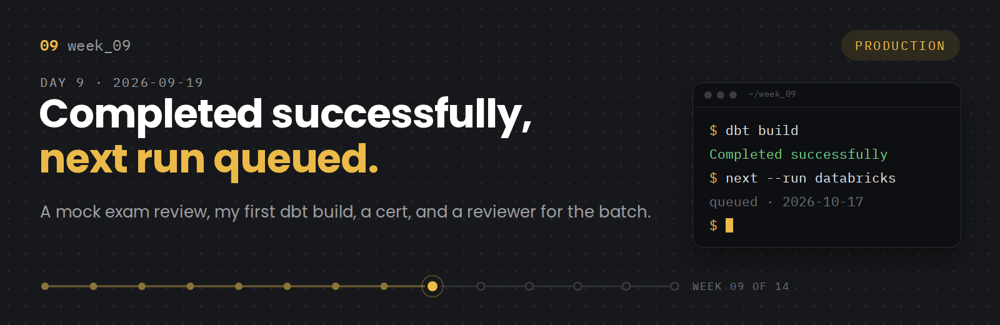
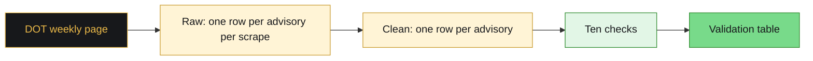
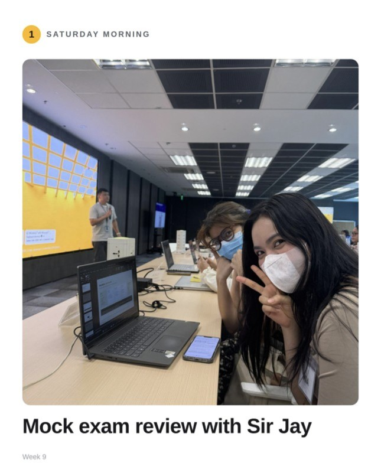
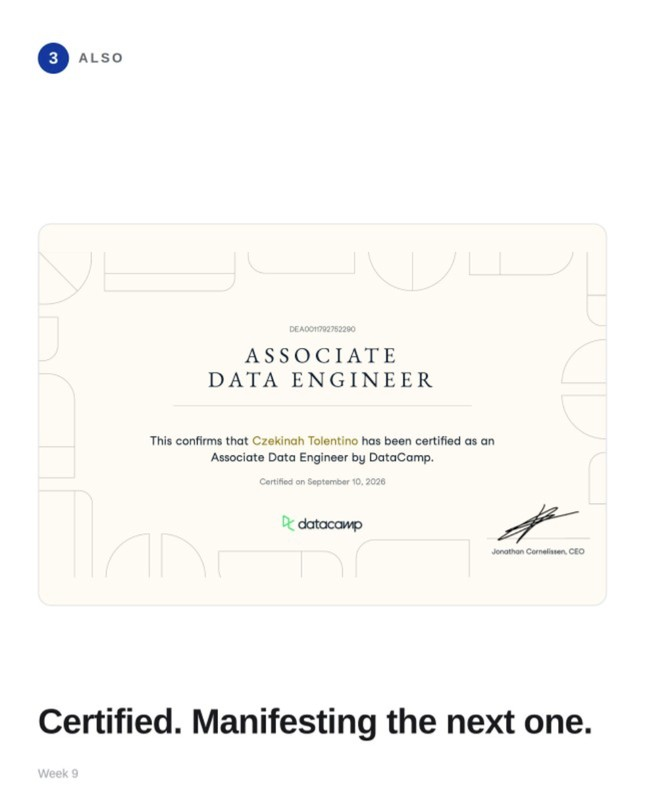
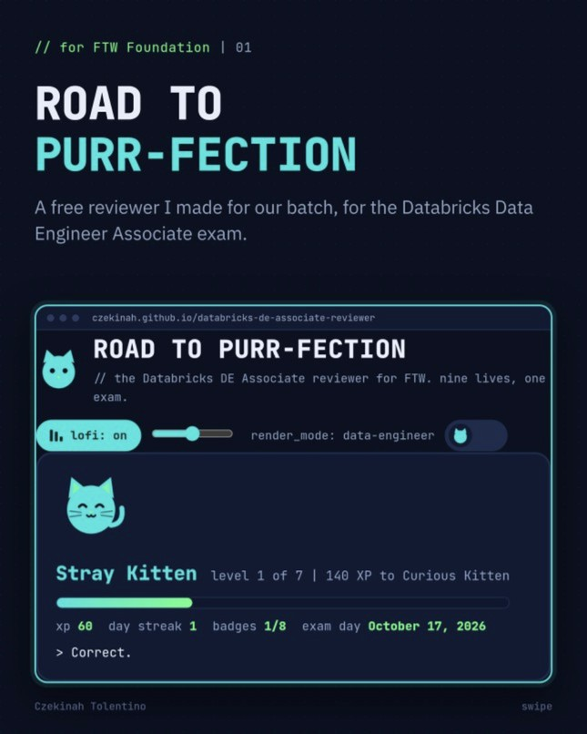
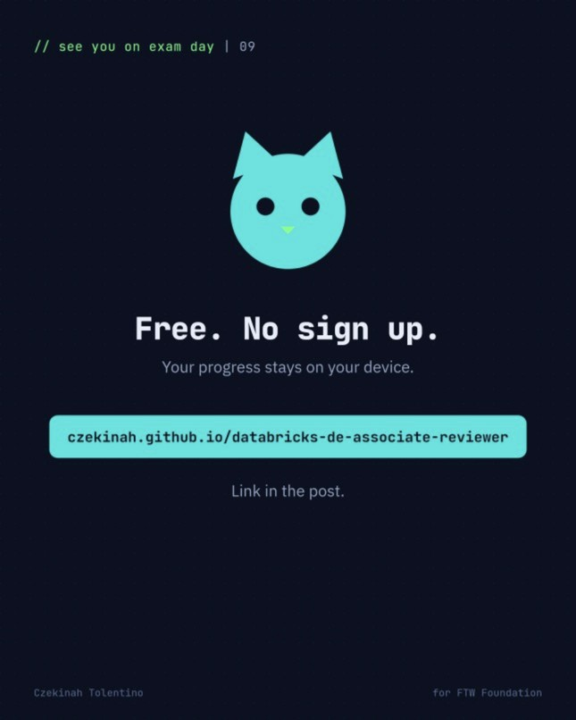
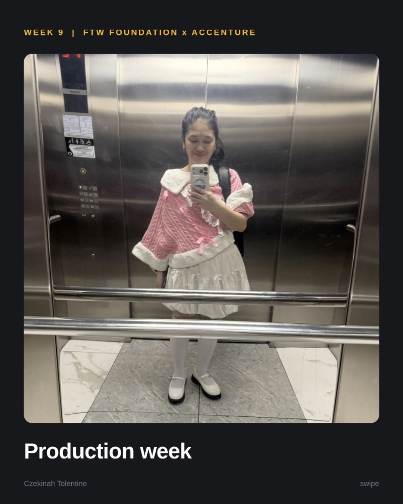
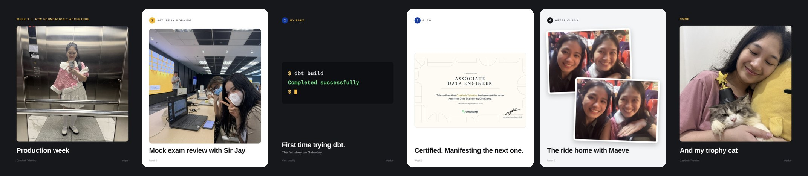
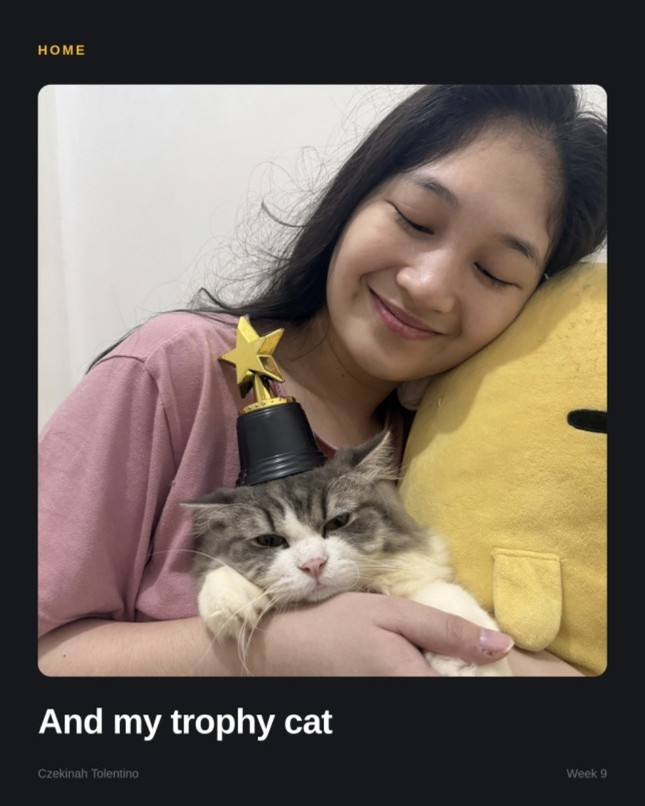

# Journal - 2026-09-19 - Day 9: Completed Successfully, Next Run Queued



**FTW Foundation Batch 12 x Accenture, Data Engineering Track.**

  

## Today in one sentence

- Week 9 was a packed Saturday and a full week after it: a mock exam review, my first dbt run, a new certificate, and a reviewer I built so our batch can study for Databricks together.

---

Okay. This one is late.

I forgot to write it that week, so it sat in the queue until now. Think of it as a job that waited its turn.

Week 9 was one of the last few weeks where we go deeper and more technical with Sir Myk. My carousel called it Production week. It was a packed Saturday.

<details>
<summary><b>You: run log first, please</b></summary>

<br>

| Step | When | What ran |
|---|---|---|
| 1 | Saturday morning | Mock exam review with Sir Jay |
| 2 | My part | First time trying dbt, for NYC Mobility |
| 3 | Also | Certified as a DataCamp Associate Data Engineer |
| 4 | After class | The bus ride home with Maeve |
| 5 | Home | My trophy cat |
| 6 | Later that week | Road to Purr-fection, a free reviewer for the batch |

Status: completed successfully. Now the long version.

</details>

---

## What I learned

### 01 The scraper, shipped


Last entry I said I took the scraping part of NYC Mobility. Here is how it landed.

The NYC DOT posts its traffic advisories on one web page. The page overwrites itself every week and keeps no archive. So our table is the only history there is.



- **Raw** keeps every scrape, with a scrape date and a key on each row. The HTML is saved first, so I can parse it again without fetching the page again.
- **Clean** keeps Type 2 history. In my own notebook I wrote that "an advisory that runs for three weeks has to stay one row that records when we first saw it and when we last saw it."
- **Ten checks** run after both. My favorite is the early warning check. If the parser breaks, it does not throw an error. It quietly finds about 4 locations instead of 26, and the load still says it worked. So one check warns when the count drops too low.

Then the group put it all together. The README, the architecture, the data model, the data dictionary and the data quality dashboards all landed in our repo on Friday and Saturday.

> [!IMPORTANT]
> Idempotent means you can prove it. Run raw and clean a second time. Every count should stay the same, and the second raw run should insert zero rows.

---

### 02 Mock exam review with Sir Jay


Saturday started with a mock exam review led by Sir Jay. He walked us through the questions and shared reviewers to help our batch prepare.



The exam is the Databricks Certified Data Engineer Associate. Our batch is aiming for October 17.

> [!TIP]
> Exam math: 90 minutes for 45 scored questions is about 2 minutes each. Answer every question. Mark the unsure ones and come back if there is time.

<details>
<summary><b>You: why WARN and not PASS</b></summary>

<br>

Because a review is not the exam. I got through it, and I am still studying. PASS has to wait for October 17.

</details>

---

### 03 First time trying dbt


For our group work on NYC Mobility, we explored dbt. It was my first time using it.

```text
$ dbt build
Completed successfully
```

Finally seeing that line in my terminal was a huge relief.

The full story belongs in the next entry. For now, here is what I know dbt does.

<details>
<summary><b>You: okay but what is dbt</b></summary>

<br>

dbt lets you write each table as a plain SELECT in its own file. That file is called a model. A model can point to another model with `ref()`, so dbt knows which one to build first. `dbt build` runs the models and their tests in that order, in one command.

It does not bring data in. The data is already in the warehouse. dbt is the part that shapes it.

</details>

---

### 04 Certified. Manifesting the next one


I also got to share a big milestone. I am now a DataCamp Certified Associate Data Engineer.



Last week it was a mug for top XP. This week it is a certificate. It feels great to see the hard work pay off after so many courses, so many XPs, and all the balancing in between.

Next one: Databricks, alongside my batchmates.

---

### 05 A reviewer for the batch


Preparing for a certification can be a lonely grind. So later that week I built something to help our batch get through it together. It is called Road to Purr-fection, and it is a free reviewer for the Databricks Data Engineer Associate exam.

<p>
  
  
</p>

What is inside:

- Study notes and flashcards for all 7 exam sections
- A timed 45 question mock exam, to practice under pressure
- A study calendar that counts down to October 17
- Exam tips, from booking to exam day
- Cat ranks, XP and badges, starting at Stray Kitten
- A notes wall where we can pin encouragement for each other
- A lofi button for the late night review sessions

It runs in the browser and saves your progress on your own device. Free, no sign up. Nine lives, one exam.

[Open Road to Purr-fection](https://czekinah.github.io/databricks-de-associate-reviewer/)

<details>
<summary><b>You: why a cat</b></summary>

<br>

It is the same cat as my portfolio, with the same two looks: one for data people and one for writers. The note inside the reviewer says the rest. Pick one section a day, check off the calendar, and pin a note on the wall when you need a push or have one to give.

</details>

---

## Terms I am still learning

- **dbt**: a tool that turns SELECT statements into tables and views, in the right order
- **Model**: one SQL file in dbt, which becomes one table or view
- **ref()**: how one model points to another, so dbt knows what to build first
- **dbt build**: one command that runs the models and their tests together
- **Materialization**: whether a model becomes a view, a table, or an incremental table

## What confused me

- Old names and new names. A lot of older mock exams still use Databricks product names that have changed since. So the reviewer has a table of the renamed products.
- Where dbt fits next to the notebooks we already have. Our NYC Mobility pipeline runs as Databricks notebooks, and dbt was new to me. The answer I am working with for now: dbt helps most when there are many tables that depend on each other.

## One small next step

- [ ] Pick one Road to Purr-fection section a day and tick off the calendar until October 17
- [ ] Score 80% or higher on two timed mock runs in a row
- [ ] Write the full dbt story in the next entry

## Git checkpoint

- [x] I created or updated a file
- [x] I wrote a commit
- [x] I pushed my changes

## Evidence from today

- The photos and slides in this entry, from my two LinkedIn carousels that week
- My Week 9 LinkedIn post: https://www.linkedin.com/feed/update/urn:li:activity:7509043106294546432/
- My Road to Purr-fection post: https://www.linkedin.com/feed/update/urn:li:activity:7509047285876461569/
- Road to Purr-fection, live: https://czekinah.github.io/databricks-de-associate-reviewer/
- Road to Purr-fection repo: https://github.com/czekinah/databricks-de-associate-reviewer
- Our NYC Mobility repo: https://github.com/cricraps/nyc-mobility-pipeline
- dbt docs: https://docs.getdbt.com/
- Databricks Data Engineer Associate certification: https://www.databricks.com/learn/certification/data-engineer-associate

## Reflection

- What felt easy: the end of the day. The bus ride home with Maeve, then home to my trophy cat. It ended the week exactly right.
- What felt difficult: my first time with dbt. That is why seeing it finally run was such a relief.
- What I want to understand better: how dbt tests compare to the ten checks I wrote by hand for the traffic advisories

## Mood or meme

- Completed successfully. Next run: October 17.





<details>
<summary><b>You: and after class</b></summary>

<br>

A long day, then the bus ride home with Maeve. Then home to my trophy cat, which is exactly the right way to end a week.



</details>

<details>
<summary><b>You: so how does this end</b></summary>

<br>

Depends who you are.

- If you are a Batch 12 batchmate: the reviewer is free, and the wall is waiting for your note. We walk into October 17 together.
- If you are Sir Jay: thank you for walking us through the questions and sharing the reviewers.
- If you are Maeve: thank you for the company on the ride home.
- If you are me at 1 a.m.: the run completed. The next one is queued for October 17. One section a day. Pet the cat. Go to sleep.

</details>

The rest of my commits will live here.
