# Journal - 2026-09-26 - Day 10: Last Lesson, First Team

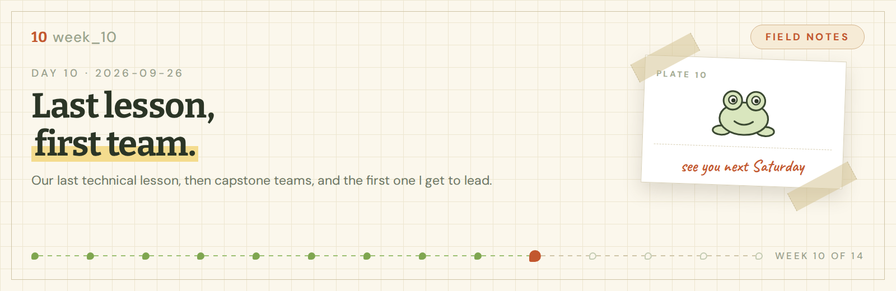

**FTW Foundation Batch 12 x Accenture, Data Engineering Track.**

  

## Today in one sentence

- Week 10 was our last technical lesson with Sir Myk, three sessions that had nothing to do with writing code, and the announcement that put me in charge of a team for the first time.

---

I sat on this entry for a few days and I think I know why. Writing a thing down makes it real, and Saturday is the kind of real I wanted to get used to slowly first.

It has not sunk in yet. It almost has. You know the feeling.

Short version: this was the last Saturday where someone stands in front and teaches us something new. The next four belong to our capstone. Then we are done.

<b>You: run log first, please</b>

 

| Step | When | What happened |
|---|---|---|
| 1 | 09:00 | Crizza and I presented our last part of NYC Mobility, using dbt |
| 2 | 13:00 | Sir Myk's last technical lesson, with our day one notes back on the screen |
| 3 | lunch | Via gave out bracelet charms |
| 4 | 14:00 | Ms. Roche, on dashboards people actually read |
| 5 | 15:30 | Ms. Carmi, on AI governance |
| 6 | 16:30 | Capstone teams announced. I am leading Buildabida |
| 7 | after | Walked around the mall twice and came home with a cat book |
| 8 | Sunday | Ten kilometers with Southies Social Club, feeding strays |

Now the long version.

---

## What I learned

### 01 The dbt story I promised last entry

Last entry I said the full dbt story belonged in the next one. This is the next one.

Crizza and I took the last part of NYC Mobility and presented it on Saturday morning. It was the final practice run before the capstone, and the first time I was not nervous about the code itself, only about the talking.

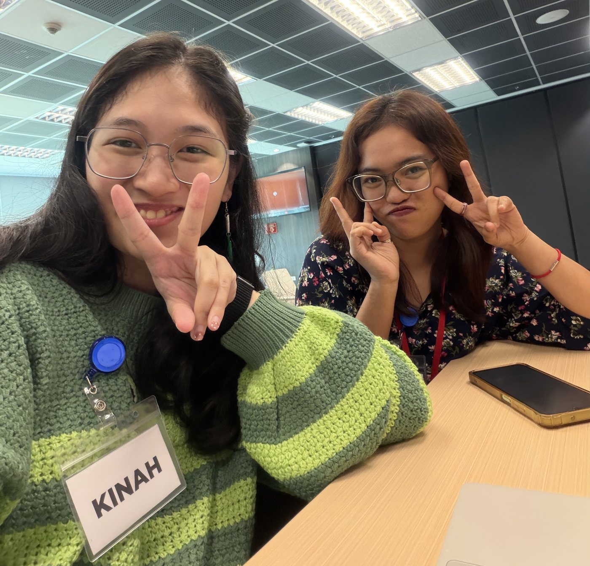

What dbt actually changed for me:

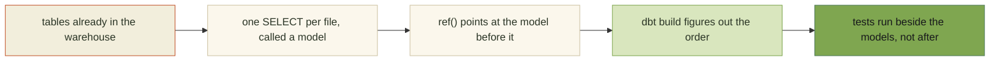

Before dbt, the build order lived in my head and in the order I clicked the notebooks. With dbt the order is in the files, so anyone can read it without asking me.

> [!IMPORTANT]
> The part nobody warned me about: most of the work is naming things. A model name is what the next person reads first, and a bad one costs more than a slow query.

<b>You: why PASS this time</b>

 

Because I can explain it to a groupmate now without opening the docs. Week 9 I could only make it run.

---

### 02 He put our day one notes back on the screen

On day one, Sir Myk made us write what we hoped to learn on sticky notes. I forgot I did that. Ten weeks later he put all of them back on the screen and asked how far we had come.

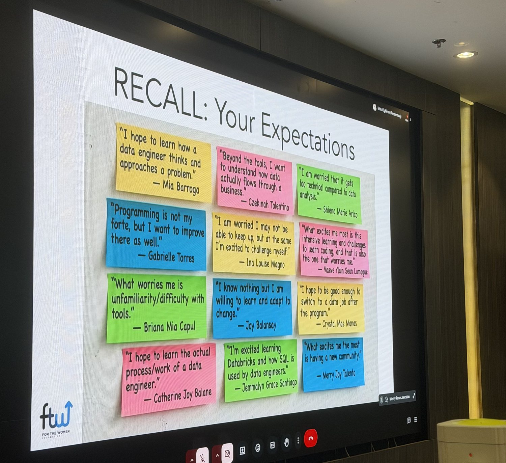

Mine was the pink one.

> "Beyond the tools, I want to understand how data actually flows through a business."
>
> Czekinah Tolentino, day one

I did not really know what I meant when I wrote that. I think I was trying to say I did not want to only learn buttons. Now I would answer it like this:

| Layer | What sits there |
|---|---|
| Bronze | the raw data, just as it came in |
| Silver | cleaned up and joined together |
| Gold | the tables the business actually uses |

That is the whole answer to my own question and it took ten weeks. Reading my own handwriting on a screen in a room full of people who also made it this far is not something I was ready for at 1 p.m. on a Saturday.

---

### 03 A dashboard nobody reads is just an expensive query

Ms. Roche took the afternoon and talked about putting things on a screen so a person can act on them. Her opening slide:

> "People hear statistics, but they feel stories."
>
> Brent Dykes, on Ms. Roche's slide

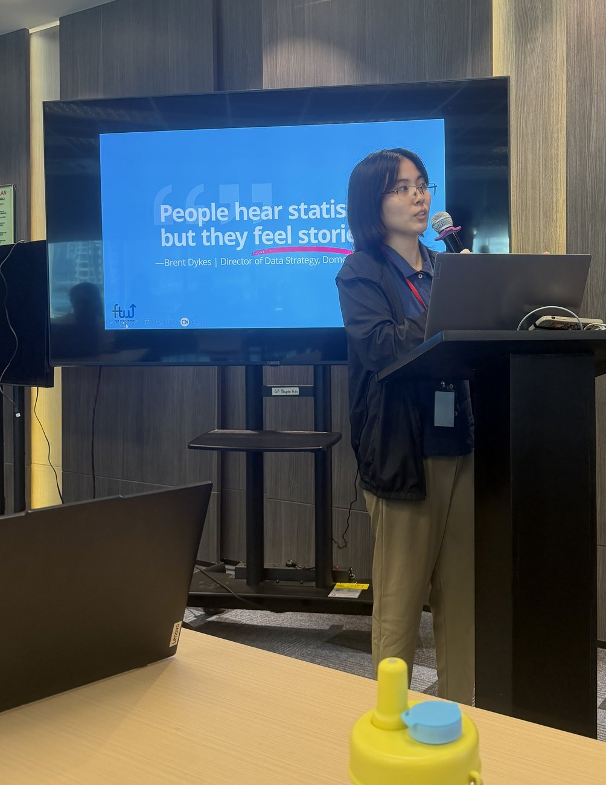

I have spent years writing copy, so this one hit a familiar nerve. The chart is not the point. The decision someone makes after looking at the chart is the point. Same job as a headline, different tools.

<b>You: what are you taking into capstone from this</b>

 

One question before I build any view for Buildabida: who opens this, and what do they do differently after?

If I cannot answer that, the view is for me, not for them.

---

### 04 AI governance, in four checkpoints

Ms. Carmi closed the day, and this was the first session in ten weeks where the answer to every question was "it depends on who is accountable."

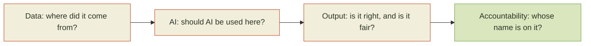

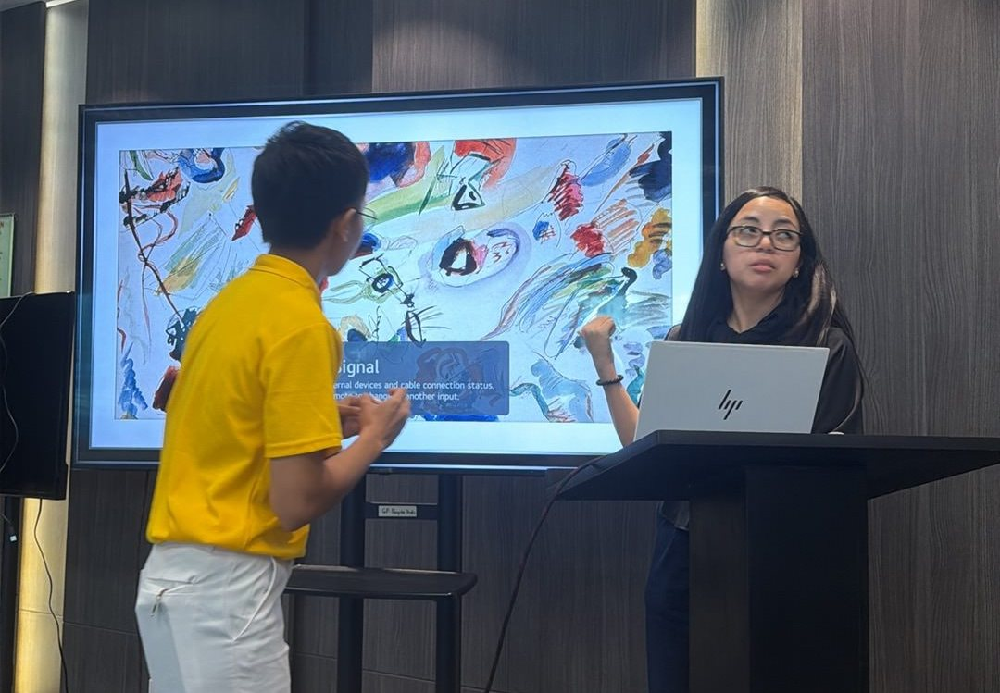

The line I wrote down and underlined: **AI assisted, human owned.**

> [!TIP]
> The last checkpoint is the one that matters. A tool can help with the first three. It cannot be the name on the output.

---

### 05 They called the teams, and mine has my name on it

At 4:30 they announced capstone groups.

First, the goodbye. Three weeks, two projects, one group chat that never slept.

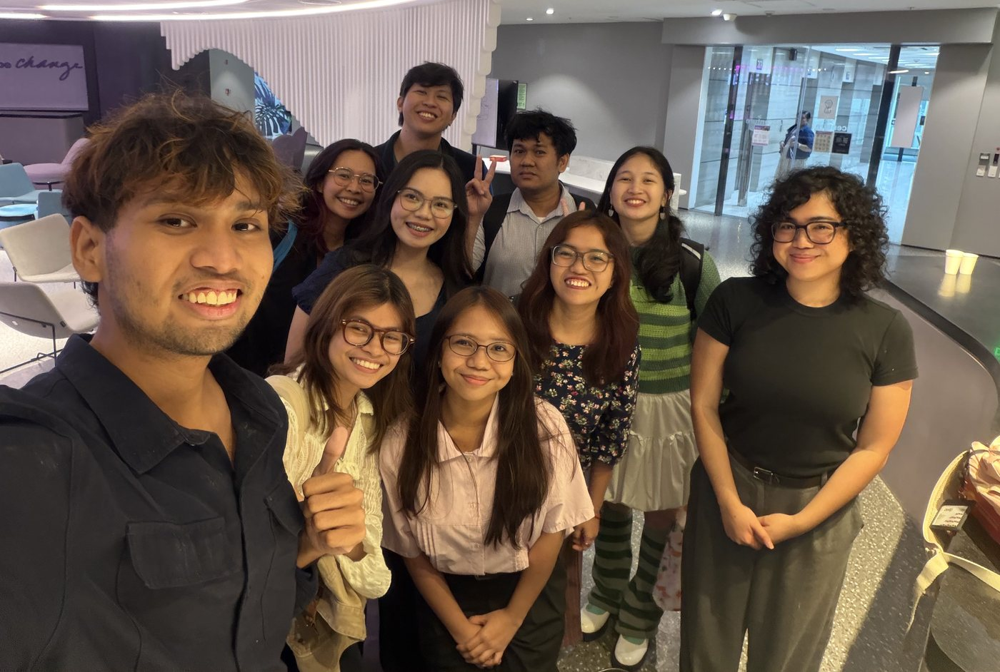

Thank you Anje, Mia, Garette, Cha, and Crizza for OULAD and NYC Mobility, and thank you Sir Hans and Sir Marc for answering every question we threw at you. I did not pick that team and I still got lucky.

Then the hello.

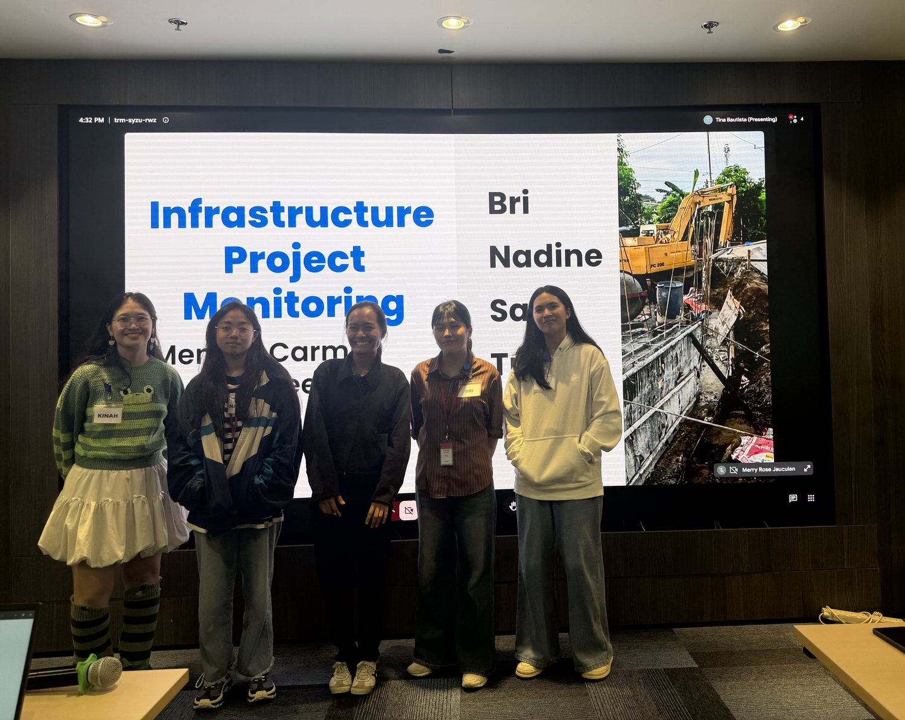

**Buildabida.** Nadine, Bri, Sam, Tricia, and me, with **Sir Simon** as our support instructor and **Ms. Carmi** as our mentor. We are building Infrastructure Project Monitoring.

And I am leading it. First time in this program, and honestly the first time anywhere that the thing I am leading is technical.

Repo: https://github.com/Buildabida/infra-project-monitoring

<b>You: are you okay</b>

 

I did not say anything when they read my name out. Then class ended and I walked around the mall twice, which is what I do instead of saying things.

I came back with a Junji Ito cat book I did not plan to buy. Yon and Mu. Then dinner, and I was fine.

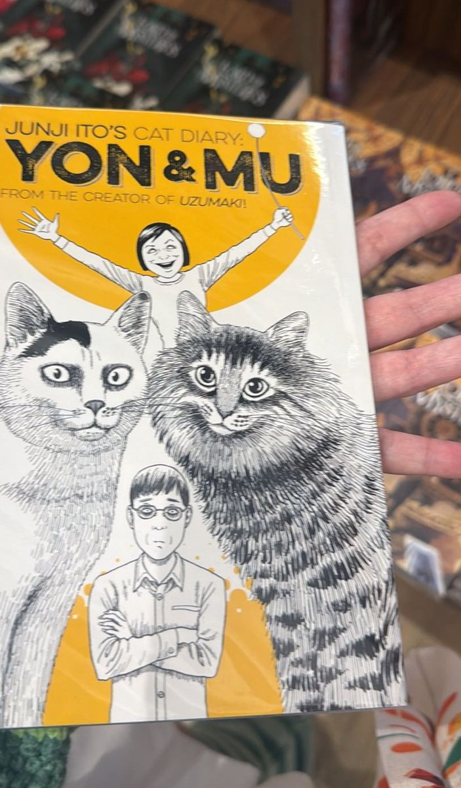

---

## Terms I am still learning

- **Model**: in dbt, one SQL file that becomes one table or view
- **ref()**: how a model points at the model it depends on, so the order is in the file and not in my head
- **AI governance**: the checkpoints a team agrees on before an AI output gets used by anyone else
- **AI assisted, human owned**: a tool can help produce it, a person is still accountable for it
- **Data storytelling**: shaping numbers around the decision someone has to make, not around the query

## What confused me

- Where governance fits in a student project. We are not shipping to customers, so it is tempting to skip it. I think the point is to build the habit now, while the stakes are small.
- What leading actually means here. My first instinct was to take the hardest ticket myself. I am fairly sure that is the wrong instinct and I have four Saturdays to find out.

## One small next step

- [ ] Write the Buildabida README so a new person can run the pipeline without asking me
- [ ] Split the first milestone into issues small enough that nobody waits on me
- [ ] Ask Sir Simon and Ms. Carmi what good looks like at week 11, before I guess
- [ ] Keep going on Databricks for October 17

## Git checkpoint

- [x] I created or updated a file
- [x] I wrote a commit
- [x] I pushed my changes

## Evidence from today

- The photos in this entry, from my Week 10 LinkedIn carousel
- Our capstone repo: https://github.com/Buildabida/infra-project-monitoring
- Our NYC Mobility repo: https://github.com/cricraps/nyc-mobility-pipeline
- dbt docs: https://docs.getdbt.com/
- Road to Purr-fection, still free for the batch: https://czekinah.github.io/databricks-de-associate-reviewer/
- Databricks Data Engineer Associate certification: https://www.databricks.com/learn/certification/data-engineer-associate

## Reflection

- What felt easy: presenting. Ten weeks ago I would have read off the screen. On Saturday I just talked.
- What felt difficult: hearing my name read as the lead and having no idea what my face was doing.
- What I want to understand better: how to run a team without becoming the person everyone has to wait for.

## Mood or meme

- Last lesson, first team. Four Saturdays left, and a project with my name on it.

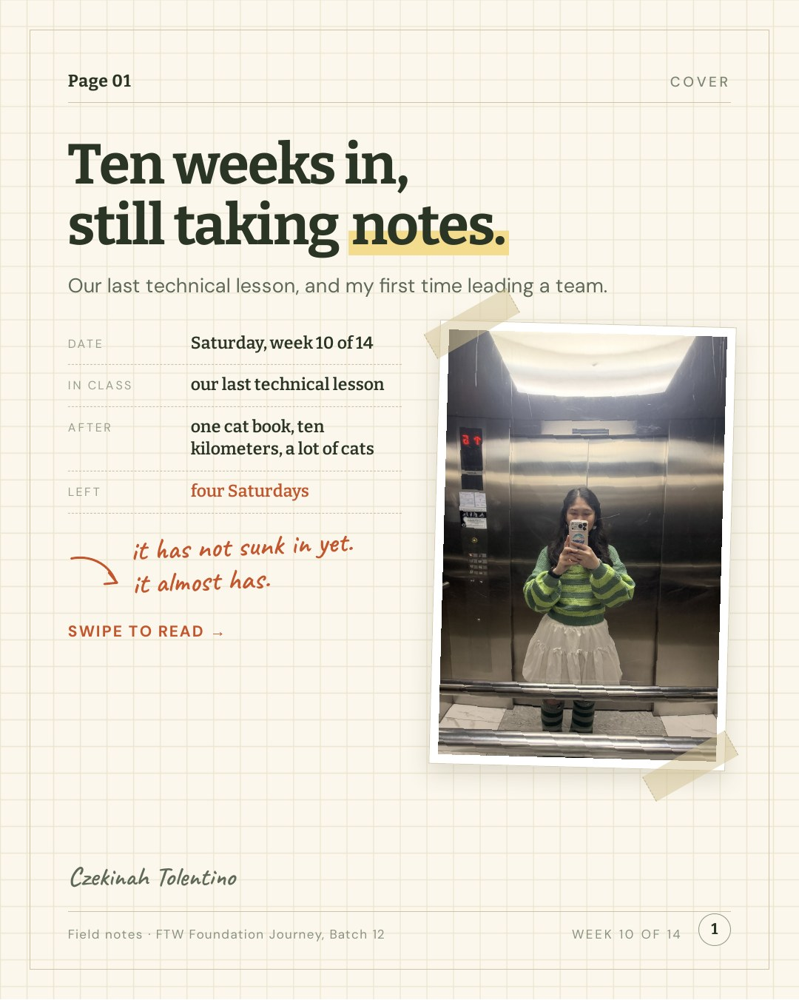

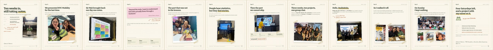

<b>You: and the part that was not in the lessons</b>

 

Via handed out bracelet charms at lunch. No reason, no occasion. I joined this program to change careers and I am leaving with friends too, which was not on the syllabus and is somehow the part I will miss most.

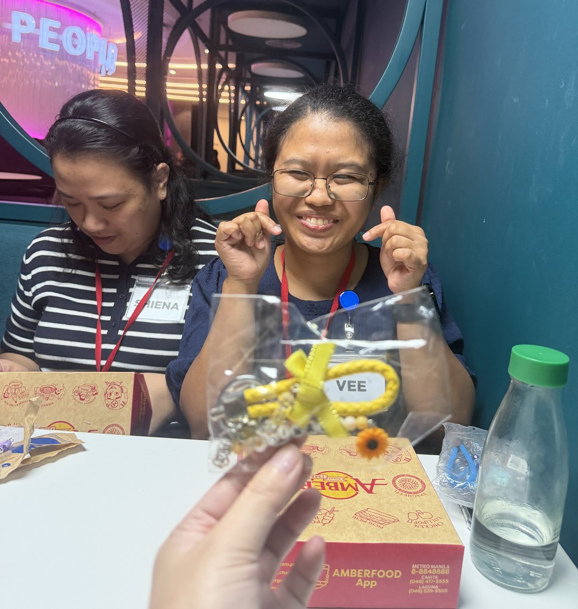

<b>You: what did you do on Sunday</b>

 

Kept walking, honestly. Ten kilometers with Southies Social Club, feeding strays the whole way.

No work, no school, nothing due. Just getting my head right before capstone week starts.

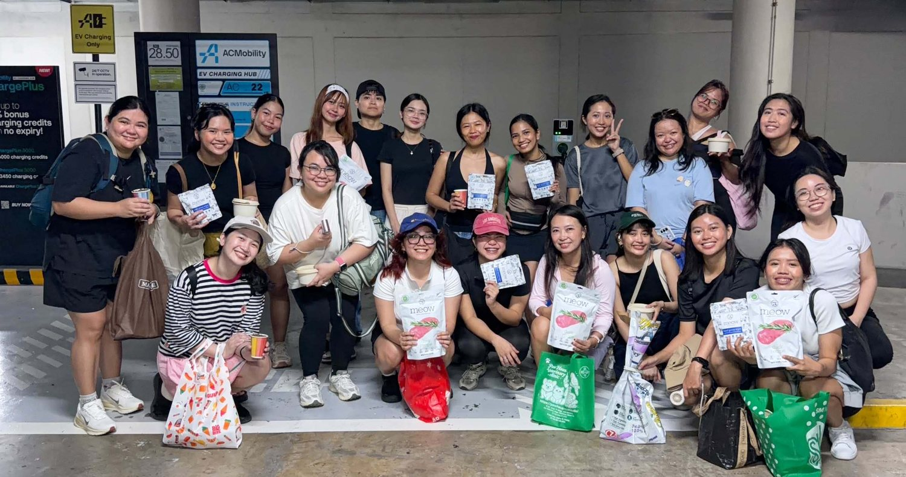

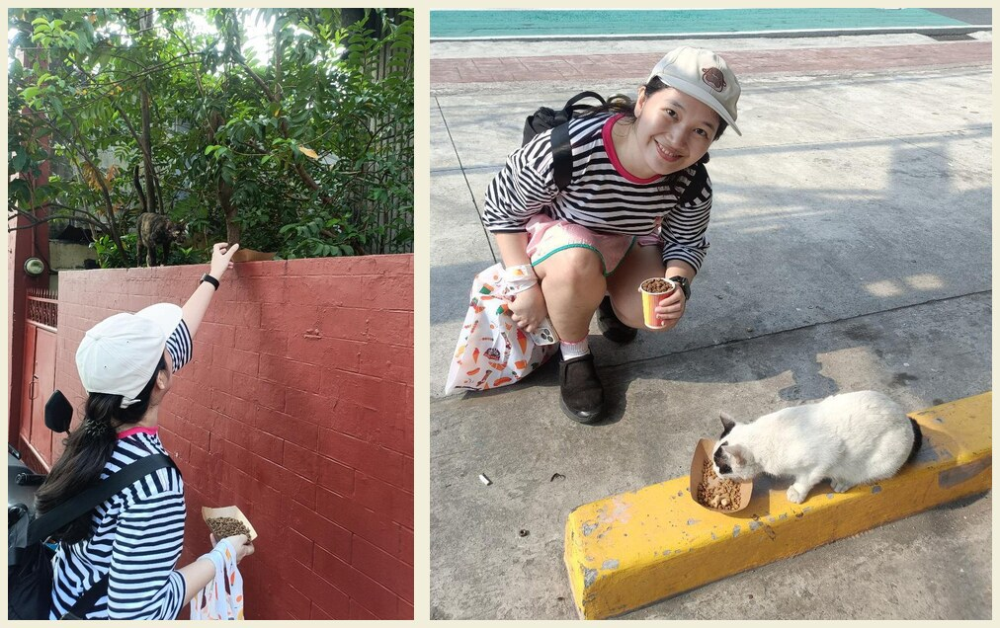

<b>You: so how does this end</b>

 

Depends who you are.

- If you are Anje, Mia, Garette, Cha, or Crizza: three weeks was not enough. Thank you for the group chat.
- If you are Sir Hans or Sir Marc: thank you for never making a question feel stupid.
- If you are Nadine, Bri, Sam, or Tricia: I will try to be the kind of lead who unblocks you instead of the kind you wait for. Tell me if I slip.
- If you are Sir Myk: the sticky note got answered. Thank you for keeping it for ten weeks.
- If you are me at 1 a.m.: it has not sunk in yet, it almost has, and that is allowed. Four Saturdays. Write the README. Pet the cat. Go to sleep.

The rest of my commits will live here.
