# Journal - 2026-10-03 - Day 11: We Survived Capstone Week

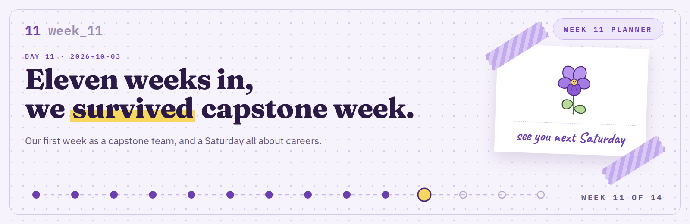

**FTW Foundation Batch 12 x Accenture, Data Engineering Track.**

  

## Today in one sentence

- Week 11 was our first week as a capstone team, and the Saturday after it was all about careers, from Accenture's data engineers to an Avon makeup demo where I ended up as the model.

---

Last entry ended with four Saturdays left. Now there are three.

This was the first week with no new lesson waiting for us on Saturday. The plan was simple: build. So the week ran like a planner, one box at a time. I also wore violet on Saturday, so this week's theme is a violet planner.

Short version: we survived.

<b>You: run log first, please</b>

 

| Step | When | What happened |
|---|---|---|
| 1 | Mon to Fri | Met and worked with my capstonemates: Nadine, Bri, Sam, and Tricia |
| 2 | Wed | Consultation call with Ms. Carmi |
| 3 | Fri | Call with our sponsors, through Ms. Tina |
| 4 | this week | Ran our first intro |
| 5 | Sat, 08:57 | Sir Jay and other data engineers from Accenture |
| 6 | Sat morning | CVs, portfolios, and LinkedIn |
| 7 | before lunch | Avon makeup workshop with Ms. Joy. I was the model |
| 8 | lunch | My closest FTW friends, now in another capstone group |
| 9 | after lunch | Ms. Paula on work-life balance |
| 10 | break | Shirt sizes, and Virna and Cole in the same shirt |
| 11 | Sunday | The Pokémon Run |

Now the long version.

---

## What I learned

### 01 Capstone week one, as the lead

Last entry I said I had four Saturdays to find out what leading means. One week in, here is what got done.

- [x] Met and worked with my capstonemates: Nadine, Bri, Sam, and Tricia
- [x] A consultation call with Ms. Carmi
- [x] A call with our sponsors, through Ms. Tina
- [x] Ran our first intro

The sponsor call is the one I keep thinking about. Our sponsors stand in for the people who will watch us on October 24, so we brought them our questions early.

> [!IMPORTANT]
> Ms. Tina's answer on trust: a pipeline has to survive an update. Keep a date on the data, load the next release without breaking the dashboard, and expect codes and columns to change.

The receipts for this part live in the team repo now: https://github.com/Buildabida/infra-project-monitoring

---

### 02 What a data engineer actually does

Saturday started at 8:57 with Sir Jay and other data engineers from Accenture. They showed us what working there is like, and they split the job into three parts.

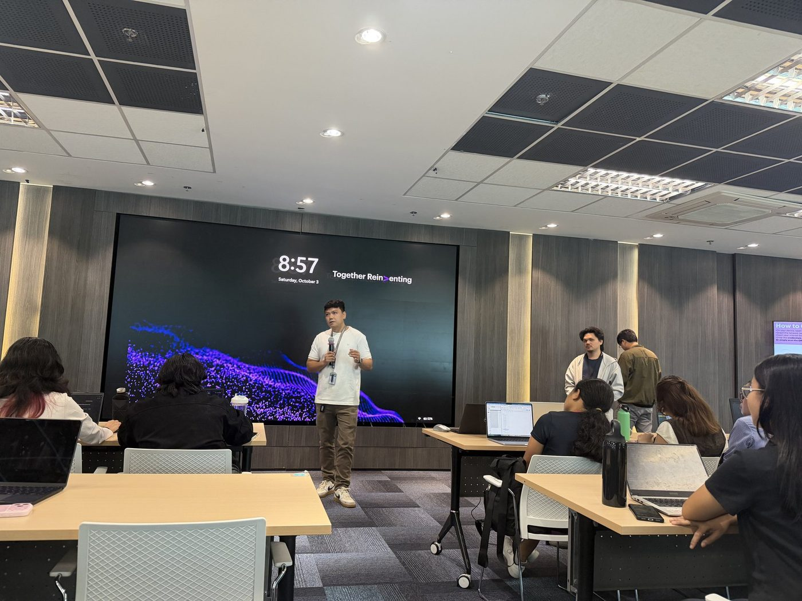

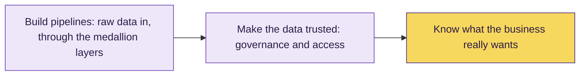

Then two demos: an AI for BI command center built on Databricks, and Genie Ontology. Both made the same point. The AI is only as good as the data under it, and only as smart as the business meaning you give it.

> [!TIP]
> One of them said it helps to write descriptions on your tables and columns in Unity Catalog, because the AI reads them first. Noted for our capstone.

<b>You: why PASS this time</b>

 

Because it matched what we are doing in Buildabida right now. Bronze, silver, gold, and then the people who have to use it.

---

### 03 Exam notes for October 17

They also walked us through how the certification exam works. These are the parts nobody puts in a reviewer.

- [ ] Use my own personal laptop
- [ ] Check the technical requirements early, not on exam day
- [ ] Run the system check: camera, Wi-Fi, audio
- [ ] Install the secure browser and set up the biometrics profile
- [ ] Close every other app before I start
- [ ] Study from the official Databricks docs

> [!NOTE]
> The line I wrote down: the certification is the entry ticket. The real work is wider, more collaborative, and more interesting than the exam.

WARN because these are still boxes, not habits. Ask me again after October 17.

---

### 04 Your CV and your LinkedIn are not the same thing

The morning session was about telling our story: CVs, portfolios, and LinkedIn.

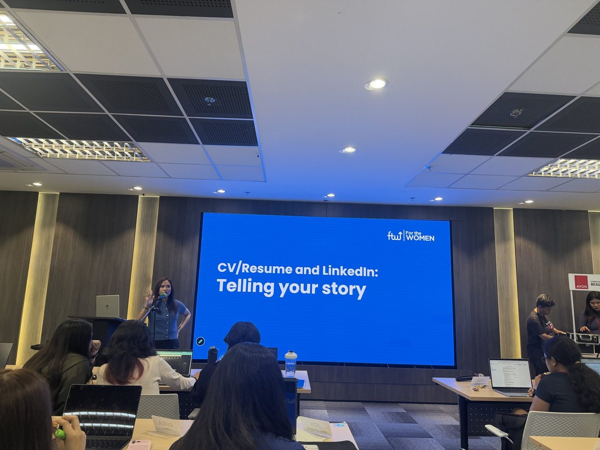

| | CV | LinkedIn |
|---|---|---|
| Used for | getting evaluated | getting found |
| Who sees it | private, sent to one company | public, recruiters search it |
| How it changes | stays the same once you send it | live, always changing |
| Tone | formal | personal and approachable |

What I am keeping:

- A recruiter spends about 7 to 15 seconds on a CV, so the best parts go on top
- One page
- Every bullet: an action, what you did, and the result, with a number if you have one
- AI is a draft partner, not a ghostwriter. It still has to sound like you

We also watched Regina Hartley's TED talk, *Why the best hire might not have the perfect resume*. It makes the case for hiring the scrapper over the silver spoon. It is about people like us, career shifters with a patchwork resume.

Then the part I needed to hear: post on LinkedIn even if it feels cringe. So, hello, connections. I updated my CV and my portfolio again.

---

### 05 Then I got called up as the makeup model

Before lunch, Ms. Joy of Avon ran a makeup workshop. I was picked as the model for the demo, so I learned interview makeup from the model's chair.

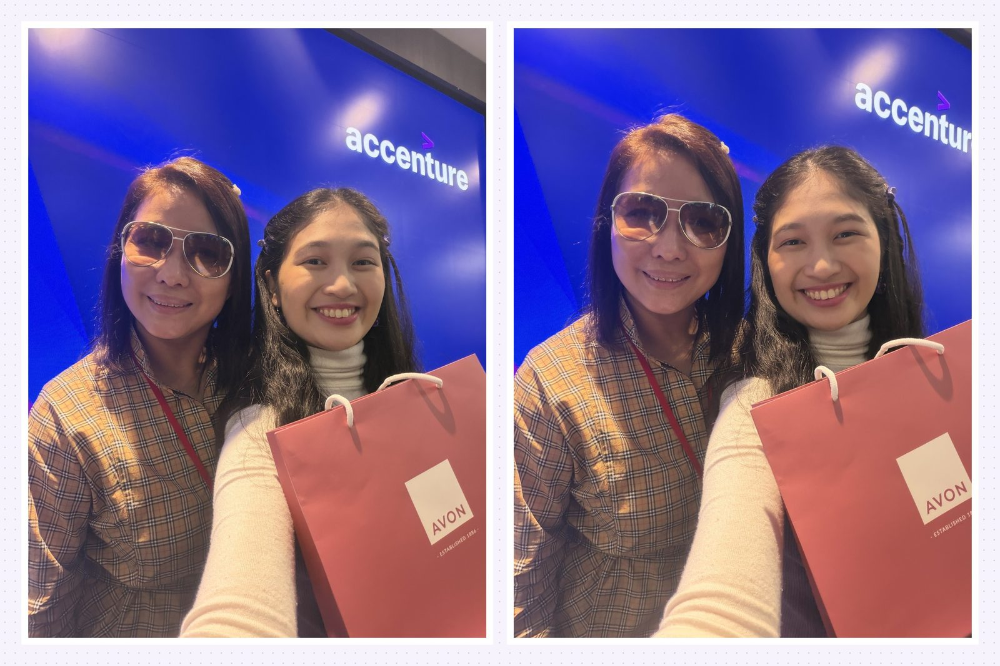

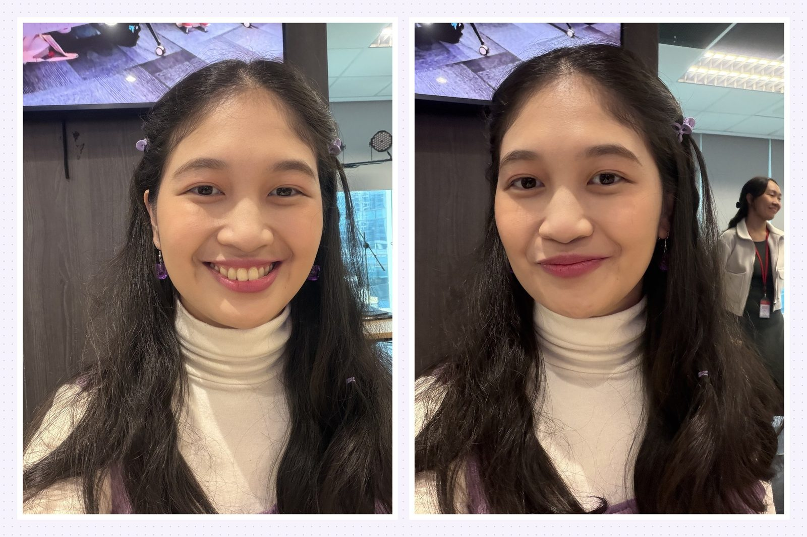

And we all went home with free makeup kits.

Ms. Joy's notes:

- Skincare first: cleanser, toner, moisturizer
- Never share your makeup. It is personal hygiene
- For a job interview: nude or pink lips
- For photos, go a little heavier than in person
- Practice makes progress

<b>You: what is in the kit</b>

 

From what Ms. Joy listed: pressed powder, blush, an eyebrow pencil, mascara, and lipstick. Enough to practice before our team photoshoot on October 10.

---

### 06 More than 20 years at Accenture

After lunch, Ms. Paula talked about balancing family, career, and yourself. Her talk was called Beyond the Hustle.

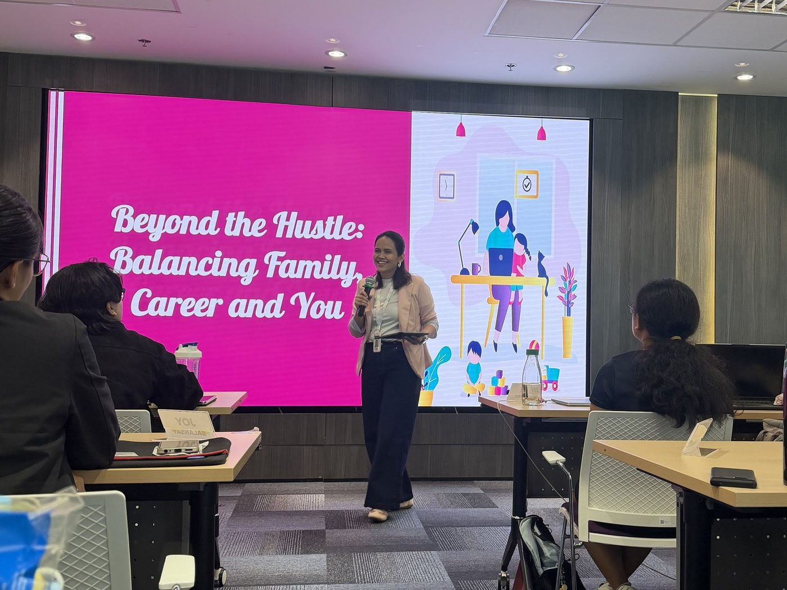

| Her point | One thing she does |
|---|---|
| Know your purpose | set boundaries and block time on your calendar |
| Live with contentment and gratitude | decide what is enough for you |
| You are more than your job | build a life outside the office too |

She has been with Accenture for more than 20 years. If that doesn't count as something worth staying for, I don't know what does.

> [!TIP]
> A question her counselor once asked her, and she passed on to us: what season are you in right now?

---

## Terms I am still learning

- **Golden dataset**: the clean, trusted data an AI or BI tool needs before it can be useful. Garbage in, garbage out
- **Semantic layer**: one agreed meaning for each business word, like net sales, so people and AI read it the same way
- **ATS**: applicant tracking system, the software that screens CVs before a person sees them
- **Proctored exam**: an online exam where someone watches you through your camera
- **Surviving an update**: when the next data release loads without breaking anything after it

## What confused me

- How the capstone gets graded. It turns out it is half documentation and half presentation, so the repo has to be as strong as the story.
- How to put numbers on work that was a team effort. The tip from class: have the AI ask you five questions first, then keep only the numbers you can defend.

## One small next step

- [ ] Silver and gold tables by October 10
- [ ] Write table and column descriptions in Unity Catalog, so Genie has something to read
- [ ] Run the exam system check before October 17
- [ ] Practice with the makeup kit before the October 10 photoshoot

## Git checkpoint

- [x] I created or updated a file
- [x] I wrote a commit
- [x] I pushed my changes

## Evidence from today

- The photos in this entry, from my Week 11 LinkedIn carousel
- Our capstone repo: https://github.com/Buildabida/infra-project-monitoring
- Databricks Data Engineer Associate certification: https://www.databricks.com/learn/certification/data-engineer-associate
- Road to Purr-fection, still free for the batch: https://czekinah.github.io/databricks-de-associate-reviewer/
- Regina Hartley's TED talk: *Why the best hire might not have the perfect resume*

## Reflection

- What felt easy: posting about it. Class told us to post on LinkedIn even when it feels cringe, and I already do it every week.
- What felt difficult: picking just one photo per moment. I picked two every time.
- What I want to understand better: how to keep a pipeline running when the source changes, before our sponsors ask again.

## Mood or meme

- Eleven weeks in, we survived capstone week. Three Saturdays left, and the build is on.

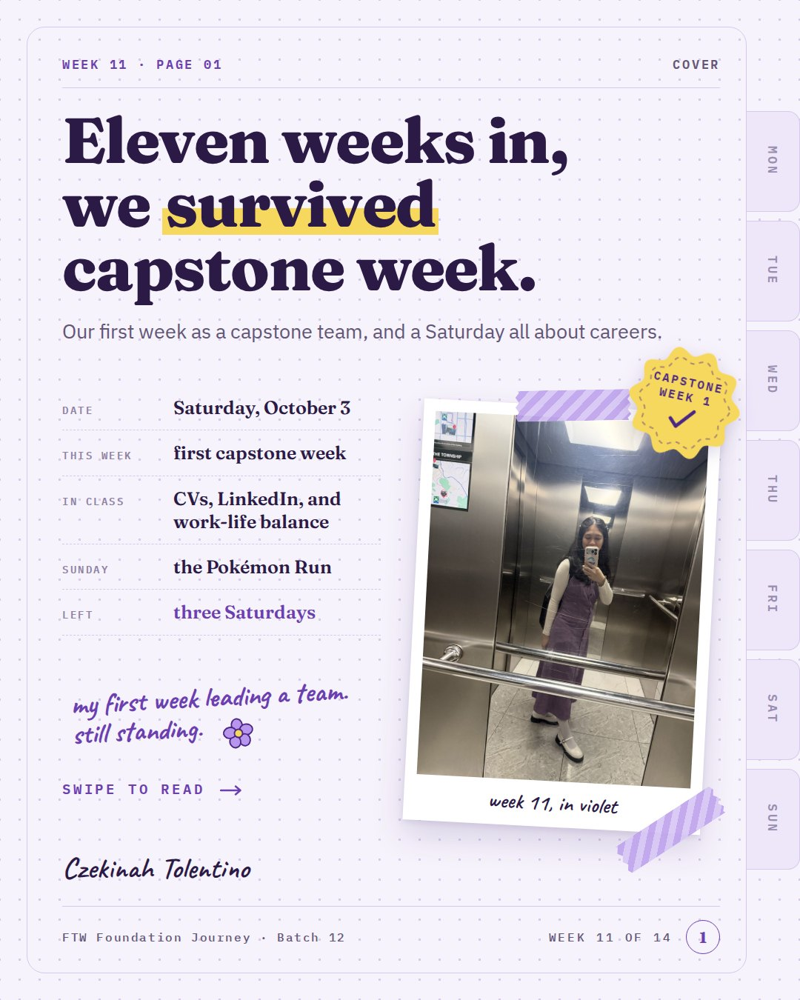

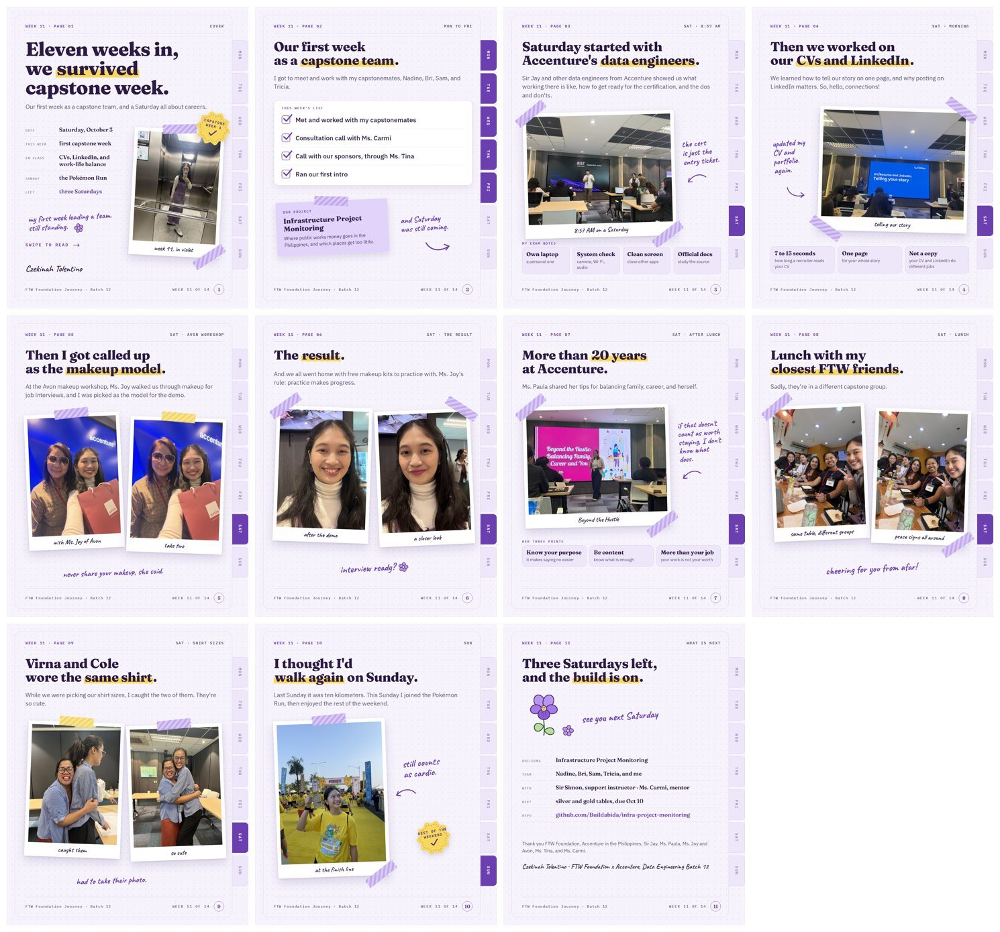

<b>You: and the part that was not in the lessons</b>

 

Lunch with my closest FTW friends. Sadly, they are in a different capstone group now, so I am cheering for them from afar.

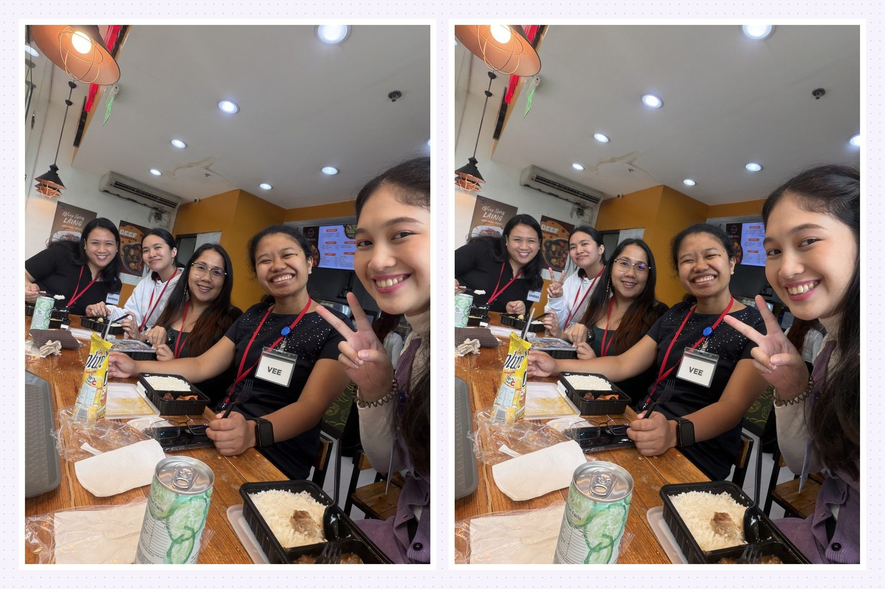

Then, while we were picking our shirt sizes, I caught Virna and Cole in the same shirt. They are so cute, I had to take their photo.

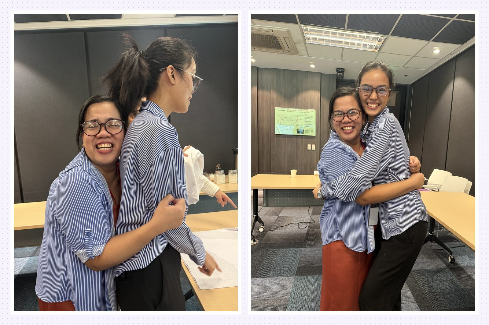

<b>You: what did you do on Sunday</b>

 

I thought I would walk again, like last Sunday. Instead I joined the Pokémon Run, then enjoyed the rest of the weekend. Still counts as cardio.

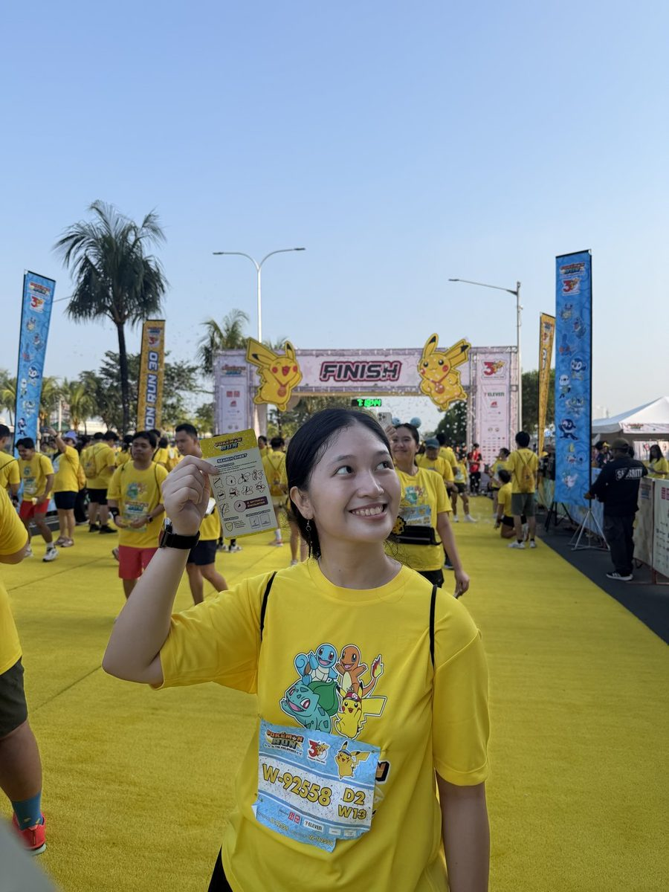

<b>You: so how does this end</b>

 

Depends who you are.

- If you are Nadine, Bri, Sam, or Tricia: one week down, three Saturdays to go. Thank you for showing up.
- If you are Ms. Carmi or Sir Simon: thank you for guiding us.
- If you are Ms. Tina: thank you for bringing our sponsors in.
- If you are Sir Jay, Ms. Paula, or Ms. Joy: thank you for the Saturday.
- If you are me at 1 a.m.: three Saturdays. Silver and gold by the 10th. Run the system check. Practice the makeup. Pet the cat. Go to sleep.

The rest of my commits will live here.
